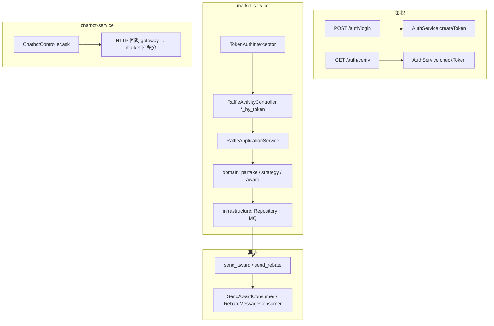

# BigMarket

- [[BigMarket 架构笔记]]
- [[BigMarket Gateway 路由]]

好的，下面是一条**纯 Java 后端**的学习路线：从 URL 进网关，跟到 Controller、领域层、基础设施和 MQ，不涉及前端实现。
---
## 你要先建立的三个认知
1. **HTTP 入口不在各微服务里各写一套**，业务 API 集中在共享库 `big-market-trigger`（Controller、MQ Consumer、Job），由 `market-service`、`message-job-service` 等启动时 scan 进来。
2. **鉴权分两层**：`auth-service` 负责签发/校验 token；`market-service` 的 `TokenAuthInterceptor` 在业务接口前拦截，把 JWT 解析成 `userId`。
3. **核心业务在 **`big-market-domain`**，Controller 只做参数、鉴权、调应用服务；MyBatis/Redis/MQ 在 `big-market-infrastructure`。
---
## 模块与服务对应关系（后端视角）
<table header-row="true">
<tr>
<td>请求路径前缀</td>
<td>落地服务</td>
<td>后端入口</td>
</tr>
<tr>
<td>`/api/v1/auth/**`</td>
<td>auth-service:8081</td>
<td>`AuthAccessController`</td>
</tr>
<tr>
<td>`/api/v1/raffle/**`</td>
<td>market-service:8083</td>
<td>`big-market-trigger` 下各 Controller</td>
</tr>
<tr>
<td>`/api/v1/chatbot/**`</td>
<td>chatbot-service:8084</td>
<td>`ChatbotController`</td>
</tr>
<tr>
<td>`/api/v1/admin/**`</td>
<td>admin-service:8082</td>
<td>`AdminConfigController`</td>
</tr>
</table>
网关配置：`big-market-gateway/src/main/resources/application.yml`
---
## 路线总览（按后端调用顺序）

---
## 第 1 站：网关 + 鉴权（JWT 原理）
### 1.1 登录签发 JWT
<table header-row="true">
<tr>
<td>项</td>
<td>内容</td>
</tr>
<tr>
<td>URL</td>
<td>`POST /api/v1/auth/login`</td>
</tr>
<tr>
<td>类</td>
<td>`big-market-auth-service/.../AuthAccessController.login`</td>
</tr>
<tr>
<td>领域</td>
<td>`big-market-domain/.../AuthService.createToken`</td>
</tr>
</table>
**原理：**
- 账号来自配置 `app.auth.dev-users`（学习用，无用户表）
- JWT payload 含 `openId`（即 userId）、`jti`、`exp`
- 密钥 `app.jwt.secret`，各服务需一致，market 才能本地验 token
**自测：**
```bash
curl -X POST <http://127.0.0.1:8080/api/v1/auth/login> \
  -H "Content-Type: application/json" \
  -d '{"userId":"xiaofuge","password":"demo"}'
```
### 1.2 校验 JWT
<table header-row="true">
<tr>
<td>URL</td>
<td>类</td>
<td>用途</td>
</tr>
<tr>
<td>`GET /api/v1/auth/verify`</td>
<td>`AuthAccessController.verify`</td>
<td>显式校验</td>
</tr>
<tr>
<td>`POST /api/v1/auth/logout`</td>
<td>`AuthAccessController.logout`</td>
<td>`jti` 进黑名单（需 Redis 撤销服务）</td>
</tr>
</table>
**必读：** `AuthService.checkToken` — 验签 + 可选 `ITokenRevocationService.isRevoked(jti)`
