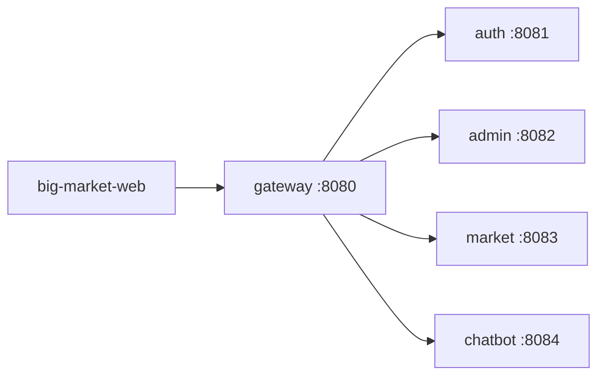

# 微服务

## big-market-gateway-service

8080 端口

| 组件                       | 说明                      |
| :------------------------- | :------------------------ |
| Spring Cloud Gateway 3.1.4 | 基于 WebFlux 的响应式网关 |
| Resilience4j               | 熔断器 + 超时             |
| Spring Boot Actuator       | 健康检查、熔断器状态暴露  |

请求处理链路:

全链路追踪 — TraceIdGlobalFilter

-   请求没有 `X-Trace-Id` 时，网关生成一个 UUID（分布式链路追踪 ID，用来把「同一次用户请求」在网关、多个微服务、甚至客户端侧的日志 串成一条线，方便排查问题）。
-   写入转发给下游的请求头，并在响应头回显。
-   `order = HIGHEST_PRECEDENCE`，尽量早执行，方便各服务日志关联同一次调用。

熔断降级 — Resilience4j + `FallbackController`

-   下游超时/失败率过高 → Resilience4j 打开熔断

-   内部 `forward` 到 `/fallback/{service}`

-   返回统一 JSON：`code=0007`，`info=网关接口调用失败`

-   和下游业务错误码区分开

    

限流 — IpPathRateLimit（可选）默认 关闭。内存令牌桶：IP + 路径前缀（刚启动时桶是满的，可以瞬间打满 burstCapacity 个请求，之后按 replenishRate 匀速恢复，桶空了再请求 → 返回 HTTP 429 Too Many Requests，不会转发到下游）

CORS — CorsConfig 浏览器的 同源策略 会拦截跨域请求。本地开发时常见场景：协议、域名、端口任一不同都算跨域。Nginx 同源反代 `/api/v1` 时不触发 CORS

## big-market-auth-service

-   端口：本地 8081
-   网关路由：`/api/*/auth/**` → `auth-service:8081`
-   login / verify / logout

JWT 内容:

-   算法：HS256
-   密钥：`app.jwt.secret`（环境变量 `JWT_SECRET`）
-   Payload 包含：
    -   `openId`：用户 ID
    -   `jti`：Token 唯一 ID（用于注销）
    -   `sub`、`iat`（签发时间）、`exp` （过期时间）等标准字段 
-   有效期：24 小时

校验：

**第一层：JWT 本身是否合法（`isVerify`）**

1.  `JwtTokenUtils.extractToken()` 去掉 `Bearer `前缀
2.  用 `JWT_SECRET` 验签
3.  检查是否过期

任一失败 → 返回 `false`。

**第二层：黑名单检查**

1.  从 Token 提取 `jti`
2.  查 `ITokenRevocationService.isRevoked(jti)`
3.  在黑名单里 → 返回 `false`（即使 JWT 本身还没过期）

**通过后**

-   `verify` 接口返回 `openId`
-   业务拦截器把 `openId` 写入 `request.setAttribute("userId", openid)`，Controller 用这个值，不信任请求体里的 userId

注销：

1.  不销毁 JWT 本身——JWT 是无状态的，没法“删掉”
2.  把 `jti` 记入黑名单，后续 `checkToken()` 会拒绝
3.  黑名单条目 TTL = Token 剩余有效期（Token 过期后黑名单条目自动清理，省内存）
4.  幂等：同一个 Token 多次 logout 都返回成功

## big-market-admin-service

端口 8082

管理端对「平台配置」做 CRUD，并同步到 Nacos。典型配置包括：

-   `chatbot.*`：AI 开关、provider、apiKey、model 等
-   `system.*`：降级开关、限流开关
-   `activity.{id}.*`：活动标题、文案、上下线状态

配置存在内存 + 本地文件（`data/platform-config.properties`），不依赖 MySQL。（admin 和 chatbot 各有一份内存：两边都依赖 `PlatformConfigService`；靠落盘 + Nacos 同步对齐，不是共享同一个 JVM 内存。）

主存储（管理端配置）：

-   namespace / key：`chatbot` / `apiKey`
-   内存：`PlatformConfigService` 的 `configStore`
-   落盘：`data/platform-config.properties`（可用系统属性 `big.market.config.store` 改路径）
-   属性名：`chatbot.apiKey.value`
-   同步：Nacos `big-market-platform-config`（开启 sync 时）

默认值是空字符串，通过 admin 的 `save` 接口写入。

兜底（chatbot 服务本地配置）：

-   `application.yml`：`chatbot.deepseek.api-key: ${DEEPSEEK_API_KEY:}`
-   环境变量：`DEEPSEEK_API_KEY`

实际取值在 `ChatbotApplicationService`：先读平台配置 `chatbot.apiKey`，没有再用上面的 yml/环境变量兜底。

-   落盘：`saveToDisk()` → `data/platform-config.properties`（可用 `-Dbig.market.config.store=...` 改路径）
-   推 Nacos：`publishToNacos()` → 调 `NacosConfigSyncService.publish()`

`NacosConfigSyncService` 负责和 Nacos 通信：

-   启动拉取：`PlatformConfigService.afterPropertiesSet()` 里 `fetchCurrent()`，用 Nacos 内容覆盖本地
-   保存后推送：`publish()` 写到 `big-market-platform-config`
-   监听变更：注册 Nacos listener，远端变了会回调 `refreshFromContent()`

1.   监听是谁注册的

`NacosConfigSyncService.addListener()` 不是 admin 调的，是 chatbot-service 的 `NacosConfigSubscriberConfig` 在启动时注册。分工可以这样记：

-   admin-service：`save/delete` → `publishToNacos()` 推送
-   chatbot-service：启动 `fetchCurrent()` + 注册 listener，变更时 `refreshFromContent()`
-   同步要开开关

只有 `nacos.config.sync.enabled=true` 时，`NacosConfigSyncService` 才会加载；否则只有本地内存 + 落盘，不走 Nacos。

3.   admin 自己还缺的两块（可选）

-   鉴权：`AdminAuthInterceptor` 拦 `/api/*/admin/**`，`public/display` 除外
-   公开读：`GET /api/v1/admin/config/public/display` 给用户端拉活动展示配置

## big-market-chatbot-service

端口 8084，职责很单一：接用户提问、按配置扣积分、调 AI（或本地兜底）、失败则退积分

-   先扣后答，失败退款：避免白嫖 AI；退款失败只打 warn，不二次抛错
-   requestId 幂等：防重复扣费（调 market 扣费时把这个 `requestId` 传过去，market 把它转成外部业务单号。防止：用户连点、超时重试、网关重放）
-   错误响应带余额：`/ask` 异常时也会尽量带回 `ChatbotAskResponseDTO`（含积分信息），方便前端展示
-   可降级：没配 DeepSeek 也能用本地 fallback，服务仍可跑
-   并发超扣：chatbot 预查余额不防并发；真正兜底在 market 的原子扣减。

## big-market-market-service

默认跑在 8083 端口。可以把它理解成：对外暴露抽奖相关 HTTP API，同时在进程内编排活动、策略、返利等领域逻辑，并可选地作为多个 Dubbo RPC 的 Provider

核心抽奖流程
