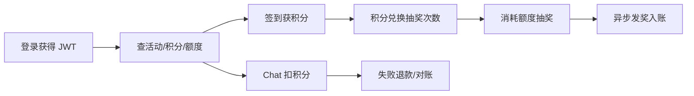

---
tags:
  - BigMarket
  - Java
  - DDD
  - 微服务
aliases:
  - BigMarket 学习入口
---

# BigMarket 项目学习地图

> [!abstract] 学习目标
> 不是背技术名词，而是能够从一个用户请求出发，说清它经过哪些服务、领域对象、数据表和异步任务，以及每一个失败分支如何收敛。

## 1. 项目一句话

BigMarket 是一个营销抽奖学习平台：用 DDD 划分活动、策略、奖品、积分、返利等领域；用 Redis 预装配概率表和库存；用责任链+决策树组织抽奖规则；用 Outbox、RabbitMQ、XXL-Job、业务幂等键和补偿任务保障资金类写路径的最终一致性。

## 2. 建议的三条学习主线

### 主线 A：DDD 视角

1. [[01-DDD-战略设计与分层]]
2. [[02-DDD-领域模型与设计模式]]
3. [[07-数据模型与状态机]]
4. 再带着“不变量和一致性边界”重读 [[04-业务流程-核心抽奖闭环]]

这条线要解决：

- 业务为什么被分成 activity / strategy / award / credit / rebate？
- 什么规则应该放在 Domain，什么只是 Application 编排？
- Entity、Value Object、Aggregate、Repository、Port 在本项目里分别是什么？
- 哪些写入必须同事务，哪些只能最终一致？

### 主线 B：微服务视角

1. [[03-微服务-服务边界与通信]]
2. [[08-治理-鉴权配置与可观测性]]
3. [[06-一致性-消息库存幂等与补偿]]
4. [[09-代码走读清单]]

这条线要解决：

- 7 个服务为什么这样拆？
- HTTP、Dubbo RPC、RabbitMQ 各适合什么场景？
- market 为什么不能扫描 listener/job？
- 服务跨边界以后，本地事务为什么失效，如何通过 Outbox/业务号/对账收敛？

### 主线 C：业务流程视角

1. [[04-业务流程-核心抽奖闭环]]
2. [[05-业务流程-签到兑换与Chat]]
3. [[06-一致性-消息库存幂等与补偿]]
4. [[07-数据模型与状态机]]
5. [[11-运营流程-上架预热配置与查询]]

按用户旅程学习：

## 3. 推荐的代码走读顺序

> [!tip] 原则
> 先跟一条端到端链路，再横向看框架。不要一上来把所有 Controller 或 DAO 读一遍。

1. `RaffleActivityController.drawByToken`：HTTP 入口与用户上下文。
2. `RaffleDrawApplicationService.draw`：DTO 与用例适配。
3. `RaffleApplicationService.executeDraw`：一次抽奖的总编排。
4. `AbstractRaffleActivityPartake.createOrder`：校验、额度和抽奖单。
5. `AbstractRaffleStrategy.performRaffle`：责任链、决策树。
6. `AwardService.saveUserAwardRecord`：构建中奖聚合。
7. `AwardDispatchSupport`：中奖记录 + task 的本地事务。
8. `SendAwardConsumer`：消费发奖事件。
9. `AwardCreditGrantSupport`：写积分奖二级 Outbox。
10. `DispatchCreditAwardTaskJob`：调 account RPC 入账。
11. 回头读 `data-and-outbox.md`：理解失败、重复和 UNKNOWN。

详细勾选表：[[09-代码走读清单]]

## 4. 知识完成标准

### DDD

- [ ] 能为 5 个核心领域写出职责和不变量。
- [ ] 能区分 Application Service、Domain Service、Repository、Port。
- [ ] 能用 `CreatePartakeOrderAggregate` 和 `UserAwardRecordAggregate` 说明聚合边界。
- [ ] 能说明“DDD 不等于按包分类”。

### 微服务

- [ ] 能画出 8080–8086 服务拓扑。
- [ ] 能区分源码模块和可部署进程。
- [ ] 能解释 account 同步 RPC 与 award 异步消息的选择。
- [ ] 能解释网关降级、JWT 吊销、Nacos 动态配置。

### 业务流程

- [ ] 能口述登录、签到、兑换、抽奖、发奖、Chat 扣退六条链路。
- [ ] 每条链路都能说出核心表、业务号、正常终态和失败补偿。
- [ ] 知道 `award_state=completed` 不等于积分已入账。
- [ ] 知道远程 UNKNOWN 不能简单当作失败。

## 5. 面试复习入口

- [[10-面试题-DDD微服务与业务]]
- 原始综合笔记：[[微服务]]

## 6. 事实与验证边界

> [!warning] 不要把学习项目说成生产就绪
> 当前代码基线是 Java 17 + Spring Boot 3.5.x；仓库文档记录的是“有条件学习冻结”。reuse acceptance 的历史通过不代表任意工作树都已重新验证；面试前应对目标提交重跑对应验收。
