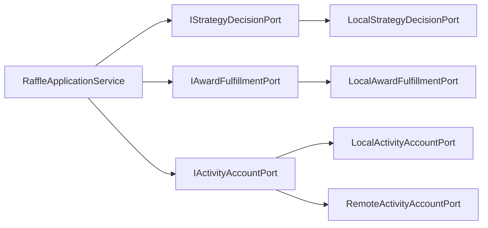
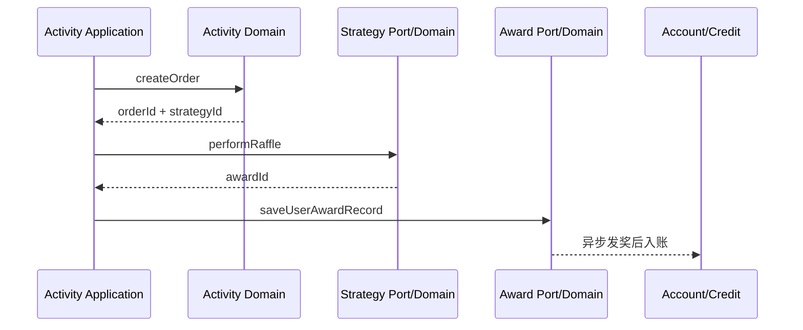

# DDD：战略设计与分层

## 1. 先区分两个层次

### 战略设计：先划分业务边界

战略设计回答：系统里有哪些业务语言？哪些模型应该被放在同一个边界内？

| 限界上下文 | 核心问题 | 主要不变量 | 代码位置 |
|---|---|---|---|
| Activity | 用户能不能参与，消耗哪个额度 | 不超过总/月/日额度；一张抽奖单只能使用一次 | `domain/activity` |
| Strategy | 按什么概率和规则出奖 | 概率分布正确；候选奖品经规则和库存检查 | `domain/strategy` |
| Award | 中奖事实如何记录与履约 | 中奖记录与发奖任务不能只成功一个 | `domain/award` |
| Credit | 积分如何增减 | 余额不得为负；同一业务号不重复入账 | `domain/credit` |
| Rebate | 哪个用户行为产生什么奖励 | 同一用户同一行为不重复发放 | `domain/rebate` |
| Auth | Token 如何签发、验证和吊销 | 签名、过期和 jti 吊销同时通过 | `domain/auth` |
| Task | 失败任务如何重试 | 按任务状态和时间有界重试 | `domain/task` |

> [!note] 子域与微服务不是一对一
> 限界上下文是模型和语言边界，微服务是部署边界。Strategy 和 Rebate 是独立业务边界，但当前部署在 market 进程内。

### 战术设计：再组织边界内模型

战术设计回答：边界内的实体、值对象、聚合、领域服务和仓储怎么协作？见 [[02-DDD-领域模型与设计模式]]。

## 2. 本项目的分层

```text
HTTP / RPC / MQ / XXL-Job
          ↓
Trigger：协议适配、鉴权、参数和 DTO
          ↓
Application：编排一次完整用例
          ↓
Domain：业务决策、不变量、聚合和领域事件
          ↓ 依赖抽象 Repository / Port
Infrastructure：MyBatis / Redis / MQ / Dubbo 实现
```

### Trigger 层

职责：

- 把 HTTP/RPC/MQ/Job 转成应用层能理解的请求。
- 处理 JWT 上下文、DTO 转换和统一响应。
- 不应决定概率、额度、库存和发奖规则。

代表类：

- `RaffleActivityController`
- `RaffleActivityServiceRPC`
- `SendAwardConsumer`
- `SendMessageTaskJob`

### Application 层

职责：组织“谁先做，谁后做”，处理跨聚合/跨领域的用例流程。

抽奖的典型编排：

```java
createOrder();                 // Activity
performRaffle();               // Strategy Port
saveUserAwardRecord();         // Award Port
// catch 后按原订单执行额度补偿
```

`RaffleApplicationService` 不应自己实现概率算法或 MyBatis 写入。

### Domain 层

职责：

- 表达业务语言和规则。
- 用 Entity/VO/Aggregate 传递业务含义。
- 用 Repository/Port 描述所需能力，不关心具体中间件。

代表类：

- `AbstractRaffleActivityPartake`
- `AbstractRaffleStrategy`
- `AwardService`
- `CreditAdjustService`
- `BehaviorRebateService`

### Infrastructure 层

职责：

- 实现 Repository/Port。
- 控制本地事务、分库路由、Redis 原子操作、MQ 发布和 Dubbo 适配。
- 把 DAO/PO 与 Domain 对象互相转换。

代表类：

- `ActivityPartakeOrderSupport`
- `StrategyAwardCacheSupport`
- `AwardDispatchSupport`
- `CreditRepository`
- `LocalStrategyDecisionPort` / `RemoteActivityAccountPort`

## 3. Repository 与 Port 的区别

| | Repository | Port |
|---|---|---|
| 表达 | 领域对象的持久化/查询能力 | 本领域需要的外部业务能力 |
| 例子 | `IActivityRepository` | `IStrategyDecisionPort` |
| 实现 | `ActivityRepository` + Support/DAO | `LocalStrategyDecisionPort` |
| 替换原因 | MySQL 换存储方案 | 本地调用换成 RPC |

抽奖编排对 Port 的依赖：



Port 带来的真实价值：当额度从 market 本地实现切换到 account RPC 时，编排逻辑仍面向 `IActivityAccountPort`，切换点留在适配器和 Profile 配置。

## 4. 限界上下文的协作



边界之间不共享内部 DAO，而是传递明确的 Entity/DTO/业务号。当前项目仍共享物理 MySQL，因此这种数据归属主要是逻辑约束，不是物理强隔离。

## 5. 学习时要带着的问题

1. 这个类在做业务决策，还是仅仅在调度？
2. 它依赖的是具体中间件，还是 Domain 定义的抽象？
3. 这次修改要维护哪个不变量？
4. 这个事务边界是一个聚合，还是跨聚合用例？
5. 异常后应该回滚本地事务，还是创建补偿事实？

## 6. 本篇面试快答

**Q：你们的 DDD 是怎么落地的？**

> 我们先按业务语言划分 Activity、Strategy、Award、Credit、Rebate 等限界上下文，再在边界内用实体、值对象、聚合和领域服务实现不变量。Domain 只依赖 Repository/Port 抽象，MyBatis、Redis、MQ 和 RPC 放在 Infrastructure。抽奖用例由 Activity Application Service 编排，核心规则则在各自领域内。

**Q：DDD 是不是只是复杂的分包？**

> 不是。分包只是表象，真正价值是明确业务语言、不变量和事务边界，以及通过依赖倒置使领域规则不被中间件绑定。

**Q：为什么不是一个领域对应一个微服务？**

> 领域边界和部署边界的变化原因不同。本项目把 Strategy/Rebate 保留为独立模型边界，但为了控制学习拓扑和运维成本，由 market 本地承载，不为了“看起来像微服务”而过度拆分。

## 7. 下一步

继续：[[02-DDD-领域模型与设计模式]]

