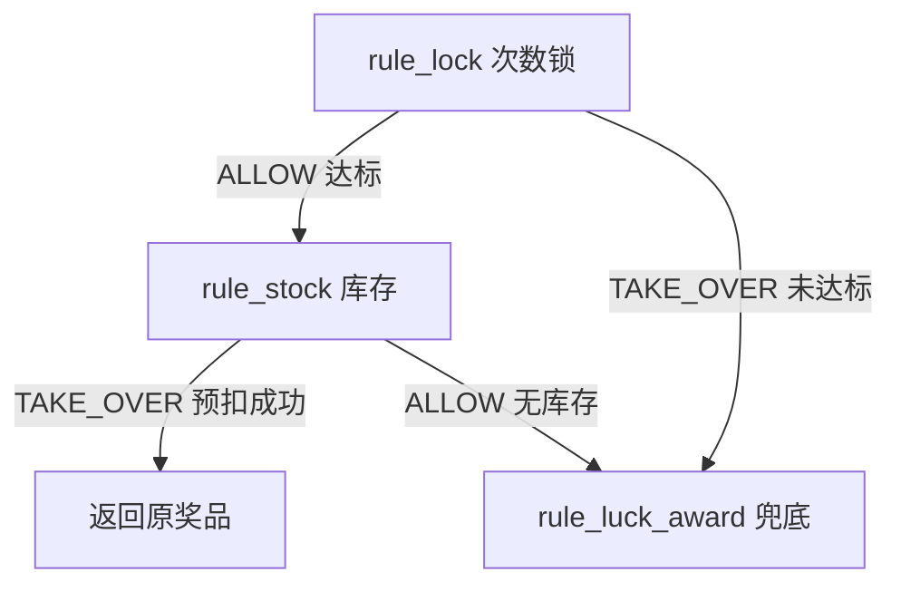

# DDD：领域模型与设计模式

## 1. 用项目代码理解 DDD 对象

### Entity（实体）

有稳定身份，会随业务流程变化状态。

| 实体 | 身份/业务号 | 关键变化 |
|---|---|---|
| `UserRaffleOrderEntity` | `orderId` | create → used/failed |
| `UserAwardRecordEntity` | `awardOrderId` | create → completed |
| `CreditOrderEntity` | `outBusinessNo` | 创建交易与幂等识别 |
| `BehaviorRebateOrderEntity` | `bizId` | 返利订单产生和履约 |

### Value Object（值对象）

没有独立生命周期，通过值表达业务概念。

- `ActivityStateVO`：活动状态。
- `UserRaffleOrderStateVO`：抽奖单状态。
- `RuleTreeVO`：一棵规则树的值结构。
- `RuleWeightVO`：权重段和奖品子集。
- `StrategyAwardStockKeyVO`：奖品库存预留的组合键。

不要把所有 `VO` 后缀都机械当成严格 DDD 值对象；判断标准是“是否依赖值相等，是否有独立身份”。

### Aggregate（聚合）

聚合用来保护一组必须一起成功的业务不变量。

#### `CreatePartakeOrderAggregate`

组成：用户额度信息 + 抽奖订单。

要保护的不变量：

- 当地路径中，总/月/日额度扣减与 `user_raffle_order` 插入同事务。
- 已有未使用 create 订单时复用，不再扣一次额度。
- 跨 account RPC 后无法依赖本地事务，需用额度 ledger、orderId 和补偿收敛。

#### `UserAwardRecordAggregate`

组成：`user_award_record` + `task` Outbox。

要保护的不变量：

- 不能只有中奖记录却没有可恢复的发奖任务。
- 不能只发出消息却没有中奖事实。
- `AwardDispatchSupport` 用本地事务一起写中奖记录、task，并推进抽奖单状态。

#### 其他聚合

| 聚合 | 一致性意图 |
|---|---|
| `CreateQuotaOrderAggregate` | SKU 订单、额度与交易信息 |
| `TradeAggregate` | 积分账户变更 + 积分流水 + 任务 |
| `BehaviorRebateAggregate` | 返利订单 + 返利消息任务 |
| `GiveOutPrizesAggregate` | 一次奖品履约所需的业务信息 |

## 2. Domain Service 与 Application Service

| | Application Service | Domain Service |
|---|---|---|
| 关注 | 完成一次用例 | 执行一项领域规则 |
| 例子 | `RaffleApplicationService` | `AwardService` / `BehaviorRebateService` |
| 主要内容 | 顺序、跨域调用、异常补偿 | 校验、计算、构造聚合、状态转移 |
| 不应出现 | 大量概率和库存细节 | HTTP DTO、Controller 响应 |

`RaffleApplicationService.executeDraw` 是跨 Activity/Strategy/Award 的用例编排；`AbstractRaffleStrategy.performRaffle` 则是策略域内的领域流程。

## 3. 设计模式不是目标，是业务变化的结果

### 模板方法：固定骨架，开放步骤

`AbstractRaffleActivityPartake.createOrder`：

```text
查未使用订单
  → 校验活动
  → 检查额度
  → 构造抽奖单
  → 交给具体实现持久化
```

价值：主流程固定，可变的校验/保存点由子类实现。

### 责任链：抽前线性分流

Strategy 链：

```text
rule_blacklist → rule_weight → rule_default
```

- 黑名单命中后直接接管。
- 权重命中后进入对应子概率表。
- 都不接管则走默认概率表。

`DefaultChainFactory` 中链节点使用 Prototype，因为节点内有 `next` 指针；若共享单例，不同 strategyId 构造链时会互相污染。

Activity 中也有 SKU 操作链：`ActivitySkuStockActionChain → ActivityBaseActionChain`，与策略规则链是同一思想在不同领域的应用。

### 决策树：抽后多分支过滤



这里 `ALLOW/TAKE_OVER` 的语义要结合节点和边理解，不是统一等同于“成功/失败”。

### 策略模式：按业务类型选实现

- 发奖：`IDistributeAward` 按奖品类型选积分奖、外部额度奖等实现。
- 活动充值：`ITradePolicy` 按充值类型选积分支付或免费返利。
- 抽奖算法：概率范围小选 `O1Algorithm`，范围过大选 `OLogNAlgorithm`。

### 工厂模式：组装规则结构

- `DefaultChainFactory`：根据 `strategy.rule_models` 构造责任链。
- `DefaultTreeFactory`：从规则树配置构造可执行树。
- Spring Bean Map 将规则模型名映射到节点实现。

### 适配器/防腐层：隔离边界变化

- `LocalStrategyDecisionPort` 把 Activity 对策略能力的需求适配到 `IRaffleStrategy`。
- `RemoteActivityAccountPort` 把额度操作适配到 account Dubbo API。
- Domain 不需要理解 Dubbo 的泛化调用、超时或网络细节。

## 4. 本地事务与领域边界

| 场景 | 能否本地事务 | 保障方式 |
|---|---|---|
| 中奖记录 + `task` | 能，同分片 | `AwardDispatchSupport` TransactionTemplate |
| 积分账户 + 积分流水 | 能，account 内 | 条件更新 + 唯一业务号 + 事务 |
| market 抽奖 + account 额度 | 不能跨 RPC | orderId/ledger + 补偿/对账 |
| 中奖记录 + RabbitMQ | 不能跨 DB/MQ | Transactional Outbox |
| Redis 预留 + MySQL 库存投影 | 不能原子跨两存储 | durable ledger + 异步回写 |

DDD 里的聚合边界不会自动解决分布式一致性。跨边界后需要将“必须同时成功”改成“有可持久的中间状态，最终可收敛”。

## 5. 代码走读任务

- [ ] 打开 `CreatePartakeOrderAggregate`，写出聚合内每个对象的职责。
- [ ] 从 `AwardService` 跟到 `AwardDispatchSupport`，找到事务边界。
- [ ] 对比 `IActivityRepository` 与 `IActivityAccountPort`。
- [ ] 跟踪 `DefaultChainFactory` 如何从配置名获取 Bean。
- [ ] 跟踪 `DecisionTreeEngine.process` 如何根据边条件选下一节点。
- [ ] 找出 O(1) 与 O(log n) 算法的选择阈值和 Redis key。

## 6. 本篇面试快答

**Q：聚合根有什么用？**

> 聚合根把需要在同一业务一致性边界中修改的对象组织起来，对外提供唯一修改入口。项目中 `UserAwardRecordAggregate` 用中奖记录和 task 保证“有中奖事实就有可恢复的发奖任务”。

**Q：责任链和决策树为什么两层？**

> 责任链处理抽前的线性分流，回答“从哪张概率表抽什么”；决策树处理抽后的多分支过滤，回答“这个候选奖品能不能真正发”。将两种变化原因分开，新增规则时不需要改抽奖主流程。

**Q：为什么 Domain 可以定义 Repository 接口，却不能依赖 MyBatis？**

> Domain 需要表达“我需要保存/查询这种领域对象”，但不需要知道它是通过 MyBatis、Redis 还是 RPC 实现。由 Domain 定义能力、Infrastructure 实现，依赖方向才会指向业务核心。

## 7. 关联

- 上一篇：[[01-DDD-战略设计与分层]]
- 下一篇：[[03-微服务-服务边界与通信]]
- 业务落地：[[04-业务流程-核心抽奖闭环]]

