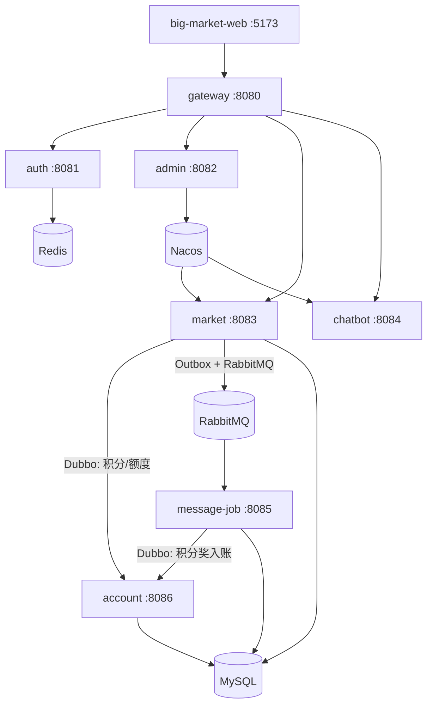

# 微服务：服务边界与通信

## 1. 当前可部署拓扑



| 服务 | 端口 | 业务边界 | 不负责 |
|---|---:|---|---|
| gateway | 8080 | 路由、Trace ID、熔断降级 | 不实现抽奖业务；用户鉴权主要在下游 |
| auth | 8081 | 登录、JWT 签发/验证、jti 吊销 | 不存放真实生产用户，学习账号来自配置 |
| admin | 8082 | 平台配置、Nacos 发布 | 不直接修改 market 进程内存 |
| market | 8083 | 抽奖 HTTP，Activity/Strategy/Award/Rebate 本地编排 | 不运行 `trigger.listener/job` |
| chatbot | 8084 | 对话、计费编排、AI provider | 不自己管积分账本 |
| message-job | 8085 | MQ Consumer、XXL-Job、Outbox 派发、对账补偿 | 不对外提供主业务 HTTP |
| account | 8086 | 积分账户/流水、活动额度/ledger RPC | 不负责抽奖规则和奖品选择 |

## 2. 源码模块不等于微服务

### 可部署启动器

`big-market-gateway` / `auth-service` / `admin-service` / `market-service` / `chatbot-service` / `message-job-service` / `account-service`。

### 共享源码库

| 模块 | 用途 |
|---|---|
| `big-market-domain` | 领域模型、领域服务、Port/Repository 接口 |
| `big-market-infrastructure` | DAO、MyBatis、Redis、MQ 发布、Port 实现 |
| `big-market-trigger` | HTTP/RPC/Consumer/Job 的源码集合，不是独立进程 |
| `big-market-api` | Dubbo 契约和 DTO |
| `big-market-types` | 通用响应码、异常、常量 |
| `big-market-management` | 平台配置帮助能力 |
| `big-market-starter-*` | DB Router、Web、Data、Dubbo、RateLimiter 等通用能力 |

### 最容易搞错的扫描边界

```text
market-service
  扫描 trigger.http / rpc / application / adapter / support

message-job-service
  扫描 trigger.listener / job
  + 消费和任务需要的 application/domain/infrastructure
```

Consumer 和 Job 的 Java 文件在 `big-market-trigger` 中，但运行时只属于 message-job。如果 market 也扫描它们，就可能出现重复消费、重复 Job 注册和重复资金效应。

## 3. 三种服务通信方式

| 方式 | 场景 | 优点 | 主要风险 |
|---|---|---|---|
| HTTP + Gateway | 前端登录、抽奖、管理、Chat | 客户端友好，统一路由和降级 | 下游超时、上下文丢失 |
| Dubbo RPC | market/message-job 调 account | 同步返回业务结果，契约明确 | 网络超时时结果可能 UNKNOWN |
| RabbitMQ | 发奖、返利、积分调整成功、库存事件 | 解耦、削峰、异步重试 | 至少一次投递导致重复，需要业务幂等 |

### 选型逻辑

- 用户发起抽奖时，必须当场知道是否可以抽、抽中什么，所以核心决策是同步的。
- 奖品履约可以稍后完成，且必须可补偿，所以通过 Outbox + MQ 异步处理。
- 积分/额度账户是 account 的权威数据，market 通过 Dubbo 调用，不能在 RPC 失败后悄悄回退到本地双写。

## 4. Gateway 请求路径

```text
/api/v1/auth/**      → auth
/api/v1/admin/**     → admin
/api/v1/chatbot/**   → chatbot
/api/**              → market 兜底
```

网关主要提供：

- `TraceIdGlobalFilter`：透传或生成 `X-Trace-Id`。
- Resilience4j CircuitBreaker：下游失败时转 `FallbackController`。
- 统一接入地址。

网关不是当前用户 JWT 的唯一鉴权点；market/admin/chatbot 会根据各自信任边界再校验。

## 5. Profile 与本地/远程适配器

| Profile | 额度/账户写入 | 意义 |
|---|---|---|
| dev/local/test | 本进程 adapter | 方便单测和本地学习 |
| docker/secure | 真实 account Dubbo RPC | 验证服务边界和分布式失败 |

这是启动期组装选择，不是运行期开关。不能在 RPC 超时后自动改用本地写入，否则会产生两个权威账本。

## 6. 微服务化以后新增的问题

1. **跨服务事务消失**：本地 `@Transactional` 无法包住 Dubbo/MQ。
2. **UNKNOWN 结果**：调用方超时不代表服务端没成功。
3. **重复请求**：客户端、RPC 重试、MQ 重投都可能重复产生效果。
4. **可观测性**：必须用 traceId + businessId + state 穿起多个进程。
5. **配置一致性**：动态配置需要权威源、发布提交点和安全默认值。

项目中的对应答案：

- 本地事务 + Outbox。
- 业务号查终态，UNKNOWN 进对账。
- MySQL 唯一键、CAS 状态转移、Redis 锁。
- Gateway/Starter Trace + Prometheus/Grafana + 业务指标。
- Nacos 作权威源，listener 整体替换不可变快照。

## 7. 本篇面试快答

**Q：你们是怎么拆微服务的？**

> 我们不是按 Controller 数量拆，而是按变化原因和数据责任拆。Gateway/Auth/Admin 是平台能力，Market 承载实时营销决策，Account 统一管资金类账户，Message-Job 统一承载消费、重试和对账。Strategy/Rebate 保留领域边界但不额外增加部署拓扑。

**Q：为什么不全部使用 RPC？**

> 用户当场需要的业务结果用同步调用；可延后、需削峰和重试的履约用消息。账户终态查询与扣减依赖 account 权威结果，所以使用 Dubbo 契约；发奖则通过 Outbox + MQ 异步收敛。

**Q：RPC 超时后为什么不能直接回滚？**

> 因为超时只说明调用方没收到结果，服务端可能已成功。若直接回滚或使用新业务号重试，可能造成双重入账或额度透支。正确做法是保留原业务号，查询远程终态后再继续。

## 8. 关联

- 流程：[[04-业务流程-核心抽奖闭环]]
- 一致性：[[06-一致性-消息库存幂等与补偿]]
- 治理：[[08-治理-鉴权配置与可观测性]]

