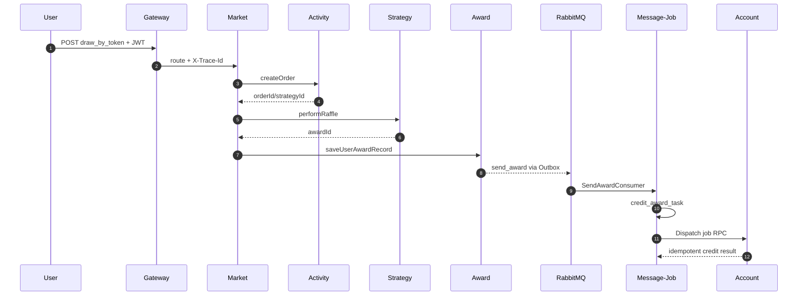

# 业务流程：核心抽奖闭环

## 1. 业务目标

用户消耗一次活动额度，在活动和策略规则内获得一个奖品，系统将中奖事实可靠持久化，并最终完成奖品履约。



## 2. HTTP 入口与信任边界

| 步骤 | 类 | 关键点 |
|---|---|---|
| 网关路由 | `application.yml` / `TraceIdGlobalFilter` | 路由到 market，透传 Trace ID |
| JWT 拦截 | `TokenAuthInterceptor` | 校验签名/过期/吊销，将 userId 写入 request |
| Controller | `RaffleActivityController` | `_by_token` 方法使用鉴权上下文，不信任请求体 userId |
| HTTP 应用适配 | `RaffleDrawApplicationService` / `RaffleActivityFacade` | DTO 转换和 HTTP/RPC 共用编排 |

## 3. 阶段一：Activity 创建或复用抽奖单

入口：`RaffleApplicationService.executeDraw` 调用 `raffleActivityPartakeService.createOrder(userId, activityId)`。

`AbstractRaffleActivityPartake.createOrder` 的思考顺序：

1. 查询用户是否已有未使用的 `create` 抽奖单。
2. 有则复用，不再扣额度。
3. 无则校验活动状态、时间和总/月/日额度。
4. 生成 `orderId`，构建 `UserRaffleOrderEntity`。
5. 本地模式下，扣额度 + 插抽奖单在同一事务。
6. 远程额度模式下，通过 account RPC/ledger 扣减，并保留后续补偿依据。

核心数据：

| 数据 | 意义 |
|---|---|
| `raffle_activity` | 活动配置与状态 |
| `raffle_activity_account` | 用户总额度 |
| `raffle_activity_account_month/day` | 月/日额度 |
| `user_raffle_order` | 消耗额度换得的一次可抽奖权利 |
| `raffle_quota_decrement_ledger` | 远程额度扣减/回滚的幂等事实 |

> [!important] `createOrder` 才是额度扣减发生处
> `RaffleApplicationService` 表面上只有一行 `createOrder`，真正的校验和扣减在 partake 领域服务及 Infrastructure Support 中。

## 4. 阶段二：Strategy 选出候选奖品

### 4.1 活动上线前的 Armory

`AbstractStrategyAlgorithm.assembleLotteryStrategy(strategyId)`：

1. 查 `strategy_award`。
2. 将每个奖品库存装入 Redis。
3. 装默认概率表 `strategyId`。
4. 有 `rule_weight` 时，为每个权重段装子表，如 `strategyId_4000`。
5. 概率范围不大于阈值时用 `O1Algorithm`，太大时用 `OLogNAlgorithm`。

O(1) 抽奖：

```text
按概率展开 awardId 槽位
  → shuffle
  → Redis Hash<index, awardId>
  → SecureRandom.nextInt(rateRange)
  → HGET 一次命中
```

> [!warning] 简历口径
> 概率表是预装配，但不要说“多线程并行预装配概率表”。线程池主要用在大范围查找和库存异步回写。

### 4.2 抽前责任链

```text
BlackListLogicChain
  → RuleWeightLogicChain
  → DefaultLogicChain
```

- 黑名单：命中后直接返回配置奖品。
- 权重：根据用户累计消耗匹配权重段，从子表抽。
- 默认：从主概率表抽。

责任链返回的是候选 `awardId`，不代表已经完成库存预留。

### 4.3 抽后决策树

`DecisionTreeEngine` 从根节点开始，根据当前节点返回的 `ALLOW/TAKE_OVER` 找下一条边。

- `rule_lock`：抽奖次数未达门槛则走兜底。
- `rule_stock`：使用 `orderId/reservationId` 预留奖品库存。
- `rule_luck_award`：返回幸运/安慰奖。

黑名单或权重链接管只是换了候选奖品；如果该奖品配了树，仍必须进入库存节点，否则接管路径会超卖。

## 5. 阶段三：Award 保存中奖事实

`AwardService.saveUserAwardRecord` 构造 `UserAwardRecordAggregate`：

```text
user_award_record
  + task(messageId, topic=send_award, state=create)
  + 抽奖单状态推进
```

`AwardDispatchSupport` 在本地事务内完成持久化。事务提交后尝试发 MQ：

- publisher confirm 成功且没有 return：task 进 completed。
- 发送异常/未确认/不可路由：task 保留 create/fail，交给 `SendMessageTaskJob` 补偿。

## 6. 阶段四：异步发奖与积分入账

```text
send_award
  → SendAwardConsumer (message-job)
  → AwardService.distributeAward
  → UserCreditRandomAward
  → AwardCreditGrantSupport
  → credit_award_task(pending)
  → DispatchCreditAwardTaskJob_DB1/DB2
  → AccountCreditServiceRPC
  → user_credit_account + user_credit_order
  → credit_award_task(dispatched)
```

最终闭环必须相关检查：

| 证据 | 能证明什么 |
|---|---|
| `user_award_record.award_state=completed` | 本地奖品流程已持久化接管 |
| `credit_award_task.state=dispatched` | 积分奖任务已成功派发 |
| `user_credit_order` 存在对应 `award_order_id` | account 已产生幂等入账流水 |
| 积分余额变更 | 实际账户效果 |

## 7. 异常与补偿

### 策略或中奖保存失败

- 抽奖单已消耗额度，但业务没有产生可用的中奖结果。
- 本地路径调 `compensatePartakeQuota`条件回退。
- 远程路径先按订单状态 CAS 取得补偿权，再按原 `orderId` 调 account 回滚。
- 远程结果 UNKNOWN 则保留待对账，不盲目重复扣/退。

### MQ 发布失败

- 中奖记录和 task 已在库中，不丢业务事实。
- `SendMessageTaskJob` 扫描到期失败任务。
- 超过有界重试上限进 `manual_pending`，不无限热循环。

### Consumer 重复消费

- 使用 `message_id`、`award_order_id`、`out_business_no` 等唯一业务键。
- Duplicate Key/INDEX_DUP 被当作幂等成功，不再产生第二次账户效果。

## 8. 走读时要记录的四列

| 阶段 | 输入业务号 | 核心写入 | 成功标志 |
|---|---|---|---|
| 参与 | `orderId` | 额度 + `user_raffle_order` | order=create |
| 策略 | `orderId/reservationId` | Redis 库存 + durable ledger | 候选奖品确认 |
| 中奖 | `awardOrderId` / `messageId` | award record + task | 本地事务提交 |
| 履约 | `awardOrderId` | credit award task + account order | dispatched + 账户流水 |

## 9. 本篇面试快答

**Q：介绍一次抽奖的完整流程。**

> 请求经网关进 market，拦截器校验 JWT 并提取 userId。Activity 先创建或复用抽奖单并扣额度；Strategy 用责任链选候选奖品，再用决策树做次数锁、库存和兜底；Award 把中奖记录与 task 同事务落库，再发 send_award。Message-job 消费后对积分奖写二级 Outbox，最后由 XXL-Job 按 awardOrderId 幂等调 account 入账。

**Q：为什么发奖不直接在抽奖请求内完成？**

> 发奖可能调外部系统，延迟和失败率不可控。若放在抽奖主链，会放大 RT，也难以安全重试。先持久化中奖事实和 Outbox，再异步履约，既缩短主链又保留补偿依据。

**Q：为什么 `award_state=completed` 不足以证明积分到账？**

> 它只表示本地奖品流程已经持久化接管。积分奖还要经过 `credit_award_task`、XXL-Job 和 account RPC。最终必须用同一 `award_order_id` 核对二级 Outbox 和 account 流水。

## 10. 关联

- 前置：[[01-DDD-战略设计与分层]]
- 一致性深入：[[06-一致性-消息库存幂等与补偿]]
- 表与状态：[[07-数据模型与状态机]]

