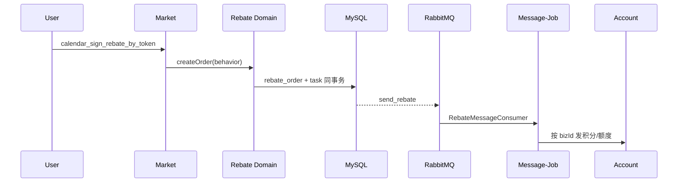
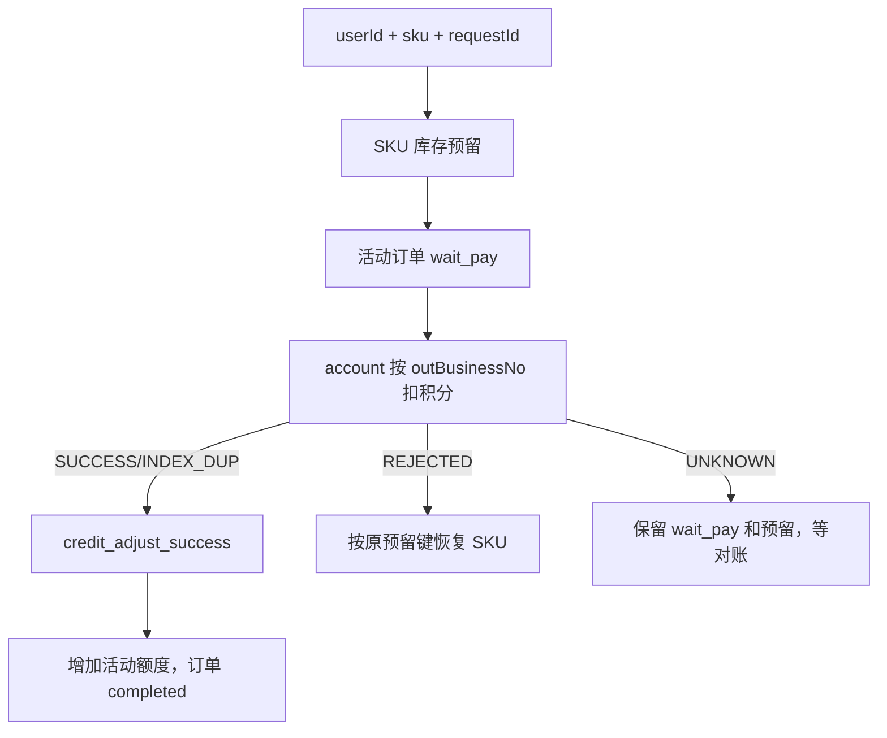
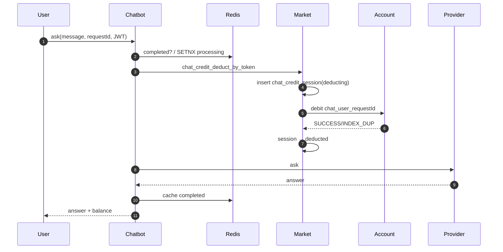

# 业务流程：签到、兑换与 Chat

## 1. 三条流程在业务上的关系

```text
签到：用户行为 → 返利订单 → 积分/额度
兑换：积分 → 购买活动 SKU → 抽奖额度
Chat：积分 → 购买一次 AI 调用 → 失败可退
```

它们共同验证了账户系统的四个要求：业务号幂等、余额条件更新、流水可追溯、异常可补偿。

## 2. 签到返利

### 2.1 入口与领域语言

- HTTP：`calendar_sign_rebate_by_token`
- 应用层：`CalendarSignApplicationService`
- Domain：`BehaviorRebateService`
- Repository：`BehaviorRebateRepository`
- Consumer：`RebateMessageConsumer`（运行在 message-job）

行为是业务输入，返利配置决定输出是积分还是活动额度。

### 2.2 正常流程



关键数据：

| 对象/表 | 用途 |
|---|---|
| `daily_behavior_rebate` | 行为到奖励的配置 |
| `user_behavior_rebate_order` | 某用户的一次返利事实 |
| `task` | `send_rebate` Outbox |
| `user_credit_order` / 额度 ledger | 最终发放效果 |

幂等键：

```text
outBusinessNo = yyyyMMdd
bizId = userId + rebateType + outBusinessNo
```

同一用户同一天再次签到，唯一键冲突被当作“已签到”，不产生第二份奖励。

### 2.3 完成标准

不能只看 HTTP 返回成功；至少需确认：

1. 返利订单存在。
2. task 已发布或处于可补偿状态。
3. 积分流水/额度账本出现同一 `bizId`。

## 3. 积分兑换抽奖额度

### 3.1 业务实质

用户不是直接“买一次抽奖”，而是用积分购买一个活动 SKU；SKU 对应一份总/日/月抽奖额度。

入口：

- Controller：`credit_pay_exchange_sku_by_token`
- Application：`CreditPayExchangeApplicationService`
- Activity Domain：`RaffleActivityAccountQuotaService`
- 积分：account RPC / `CreditAdjustService`
- 履约 Consumer：`CreditAdjustSuccessConsumer`

### 3.2 流程与状态



必须由客户端提供 `requestId`，业务号稳定生成：

```text
out_business_no = userId + "_" + sku + "_" + requestId
```

不能用毫秒时间戳当业务号，否则同一请求重试会生成新单，幂等失效。

### 3.3 为什么 UNKNOWN 不恢复库存

account 可能已扣积分，只是 market 没收到响应。若此时恢复 SKU，用户可以再买一次，而原单后续又可能对账为成功，造成库存和额度重复。

UNKNOWN 路径应保留：

- 原 `out_business_no`。
- `wait_pay` 订单。
- SKU durable reservation。
- 对账任务，后续查 account 订单终态。

## 4. Chat 积分扣费与退款

### 4.1 角色分工

| 服务 | 职责 |
|---|---|
| chatbot | 参数/幂等门禁、读配置、调 AI、发起扣退 |
| market | 维护权威 `chat_credit_session`，编排 account 扣退 |
| account | 真正修改积分账户和流水 |
| message-job | 退款重试、`deducting` 对账、远程写对账 |

### 4.2 正常计费流程



双层幂等：

| 层 | Key | 作用 |
|---|---|---|
| Chatbot Redis | `chat:request:{userId}:{requestId}` | 快速返回已完成回答，拦并发重复 |
| Account MySQL | `chat_{userId}_{requestId}` | 即使 Redis 丢失，也不重复扣账 |

Redis 只是快速门禁，账户幂等的最终依据是 MySQL 业务唯一键。

### 4.3 为什么先写 `deducting` 再调 account

若先扣钱再记会话，调用成功后 market 宕机，系统就找不到这笔扣款应该对应哪次 AI 调用，也无法安全退款。

先写意图：

```text
chat_credit_session(deducting)
  → remote debit
  → SUCCESS: deducted
  → REJECTED: failed
  → UNKNOWN: 保持 deducting，由 ChatDeductReconcileJob 查账
```

### 4.4 AI 失败后的退款

退款业务号：

```text
chat_refund_{userId}_{requestId}
```

退款状态大意：

```text
none/pending → refunding → refunded
                         ↘ manual_pending
```

原则：

- 没有真实 deduction session 不允许凭空退款。
- 扣款和退款使用不同但稳定的业务号。
- 失败使用 `next_retry_time` 和有界指数退避。
- 超过上限进 `manual_pending`，不无限自动退款。

### 4.5 免费 provider

默认 local provider 可以不计费；只有实际配置了可计费 provider 和费用时才进扣款链。不能把“调用失败自动悄悄切 local provider”作为降级，因为用户已经支付的服务语义会被改变。

## 5. 三条流程对比

| 流程 | 主业务号 | 库存/余额 | 最终终态 |
|---|---|---|---|
| 签到 | `bizId=userId+type+date` | 增积分/额度 | 返利订单 + account 流水 |
| SKU 兑换 | `{userId}_{sku}_{requestId}` | 减 SKU，减积分，增额度 | activity order completed + 额度 |
| Chat 扣款 | `chat_{userId}_{requestId}` | 减积分 | session deducted + AI answer |
| Chat 退款 | `chat_refund_{userId}_{requestId}` | 增回积分 | session refunded + reverse order |

## 6. 本篇面试快答

**Q：如何保证一天只签到一次？**

> 用户 ID、返利类型和日期构成稳定 bizId，返利订单上建唯一约束。并发请求中只有一个可以插入，重复键被视为已签到；后续 Consumer 也继续使用同一 bizId 幂等发奖。

**Q：SKU 兑换中先扣库存还是先扣积分？**

> 流程先按业务号预留 SKU 并创建 wait_pay 订单，再调 account 扣积分。明确拒绝时按原预留键幂等恢复；UNKNOWN 时保留订单和预留等对账，避免扣款已成功却提前释放库存。

**Q：Chat 为什么 Redis 和 MySQL 都要幂等？**

> Redis 处理高频重放和并发在途请求，可以直接返回旧回答；但 Redis 可能过期或丢失，账户效果必须依赖 MySQL `out_business_no` 唯一约束。前者是快速幂等，后者是资金类底线。

## 7. 关联

- 抽奖主链：[[04-业务流程-核心抽奖闭环]]
- 幂等与补偿：[[06-一致性-消息库存幂等与补偿]]

