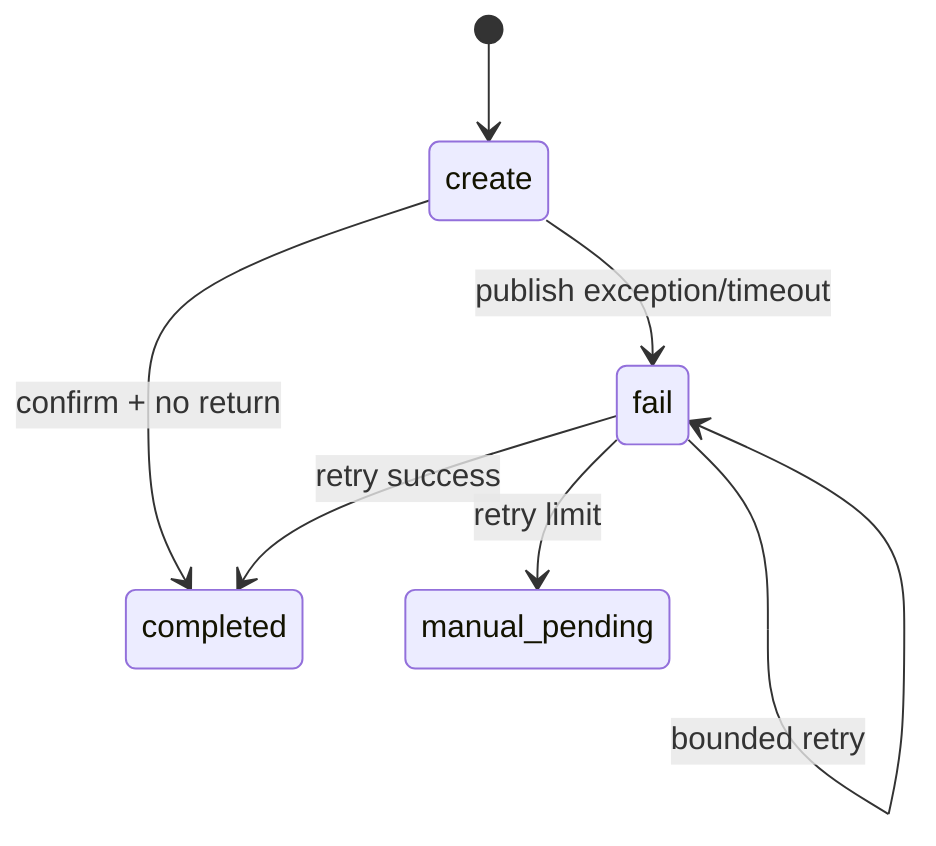
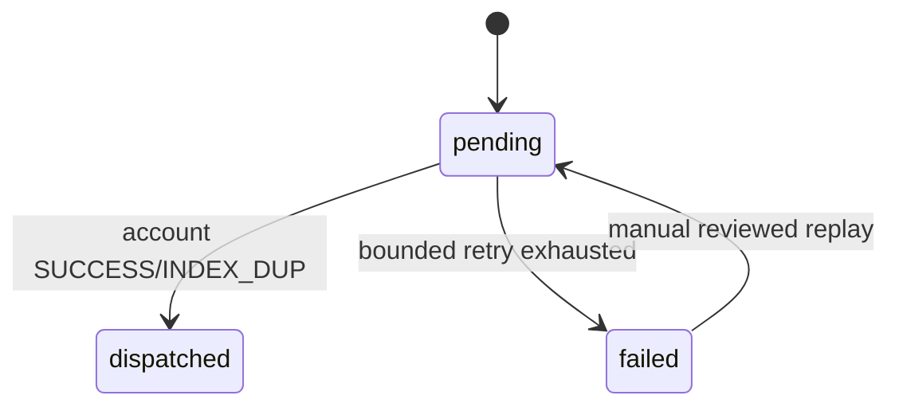

# 一致性：消息、库存、幂等与补偿

## 1. 先建立一个判断框架

看到一条资金/库存写链时，固定问八个问题：

1. 权威业务事实存在哪里？
2. 这次操作的稳定业务号是什么？
3. 什么能在同一本地事务内？
4. 跨了哪个 DB/MQ/RPC/Redis 边界？
5. 调用返回 SUCCESS、REJECTED、UNKNOWN 时分别怎么做？
6. 重复请求/重复消费时用哪个唯一键消化？
7. 补偿任务由谁扫描，重试是否有上限？
8. 怎样证明真正达到业务终态？

## 2. Transactional Outbox

### 2.1 要解决的双写问题

```text
方案 A：先发 MQ，后写 DB
  MQ 成功 + DB 失败 = 下游执行了一个不存在的业务

方案 B：先写 DB，后发 MQ
  DB 成功 + 进程在发 MQ 前宕机 = 业务永远没被下游看见

Outbox：
  业务数据 + task 同事务
  事务后发 MQ
  失败任务可扫描重试
```

### 2.2 Task 状态的语义



不能只调用 `rabbitTemplate.convertAndSend` 就立即标记 completed。“方法没抛异常”不等于 broker 已确认且路由成功。

## 3. 二级 Outbox 为什么存在

积分奖链路有两个分布式边界：

```text
market DB → RabbitMQ/message-job
message-job DB → account RPC
```

第一级 `task` 保证中奖事实能送到 message-job；第二级 `credit_award_task` 保证 message-job 已接管的积分奖不会因 account RPC 失败而丢失。



## 4. 库存：Redis 热路径 + MySQL durable ledger

### 4.1 为什么不直接每次 UPDATE MySQL

- 抽奖库存是高并发热点行。
- 每次同步更新 MySQL 会增加锁竞争和主链 RT。
- Redis 原子预留适合实时判断，MySQL 适合持久化终态。

### 4.2 为什么不能只靠 Redis SETNX

Redis 给出的只是快速状态。若在 SETNX 成功后、MySQL 更新前宕机，单凭 Redis key 无法证明这次预留是否已投影到 DB。Redis 也可能淘汰/过期/丢数据。

因此项目使用：

```text
稳定预留键
  → MySQL ledger reserved
  → Redis 原子预留
  → 延迟队列/pending set
  → Job 合并 Redis pending + MySQL reserved 扫描
  → MySQL 库存 -1 + ledger applied 同事务
```

### 4.3 两类库存的幂等键

| 库存 | 业务预留键 | Ledger |
|---|---|---|
| Strategy Award | `reservationId`，抽奖通常是 `orderId` | `strategy_award_stock_decrement_ledger` |
| Activity SKU | `(sku, lockSurplus)` + 兑换业务号 | `activity_sku_stock_decrement_ledger` |

Job 重放时，同一 ledger 只能从 `reserved` 转 `applied/released` 一次，从而避免 MySQL 重复减库存。

## 5. 幂等的分层

| 层次 | 手段 | 解决什么 | 能否单独托底 |
|---|---|---|---|
| 接口 | `requestId` | 让客户端重试仍是同一业务 | 不能 |
| Redis | SETNX/lock/completed cache | 高频并发重复和快速返回 | 不能，可丢失 |
| MySQL | unique business key | 防止最终重复账户/订单效果 | 是核心底线 |
| 状态机 | CAS transition | 保证只有一个执行者获得推进/补偿权 | 与唯一键配合 |
| Consumer | duplicate-key as success | 适应 MQ 至少一次投递 | 必须有 DB 约束 |

## 6. 业务幂等键目录

| 场景 | Key |
|---|---|
| 积分交易 | `out_business_no` |
| Chat 扣费 | `chat_{userId}_{requestId}` |
| Chat 退款 | `chat_refund_{userId}_{requestId}` |
| SKU 兑换 | `{userId}_{sku}_{requestId}` |
| 积分奖派发 | `award_order_id` |
| MQ Outbox | `message_id` |
| 签到返利 | `biz_id={userId}_{type}_{yyyyMMdd}` |
| 奖品库存 | `reservationId/orderId` |
| 额度扣减 | 每次 draw/order 的 ledger key |

## 7. SUCCESS / REJECTED / UNKNOWN

| 结果 | 语义 | 处理 |
|---|---|---|
| SUCCESS | 远程已明确完成 | 推进本地终态 |
| INDEX_DUP | 同业务号已经成功写入 | 当作幂等成功，不再写一次 |
| REJECTED | 远程明确没有执行，例如余额不足 | 可执行业务拒绝分支和幂等恢复 |
| UNKNOWN | 超时/网络错误，不知远程是否成功 | 保留原业务号和中间状态，对账查终态 |

> [!danger] 最危险的错误
> 把 UNKNOWN 当 REJECTED，立即释放库存/回滚额度；或者生成一个新业务号重试。这会破坏原本的幂等语义。

## 8. 重试、死信与人工介入

- task 重试使用 `retry_count` / `next_retry_time` / `last_error`。
- 延迟有上限，毒性任务进 `manual_pending`。
- RabbitMQ 金钱效应消息进 DLQ 后默认不自动重放。
- 先核对 queue、business id、远程终态，人工将单条任务改为 reviewed，才允许重放。
- 重放必须使用原业务号。

## 9. 如何验证一条链真正闭环

| 链路 | 必须相关的证据 |
|---|---|
| 积分奖 | award record → credit award task → account order/balance |
| 签到 | rebate order → task → credit/quota ledger |
| SKU 兑换 | activity order → credit order → quota → stock ledger |
| Chat 扣退 | session → debit order → refund order → final balance |
| 奖品库存 | Redis reservation → durable ledger → MySQL surplus |

健康端点、静态 validator 和“有代码”都不能单独证明链路闭环。

## 10. 本篇面试快答

**Q：如何保证 DB 和 MQ 的一致性？**

> 不做 DB/MQ 双写，而是把业务数据和 task Outbox 放在同一本地事务。提交后发消息，publisher confirm 且没有 return 才标记完成；失败由 XXL-Job 按状态和下次重试时间补发。Consumer 端再使用业务唯一键消化重投。

**Q：Redis 扣库存后进程宕机怎么办？**

> 不把 Redis 当唯一事实。每次预留有稳定 reservationId，并在 MySQL ledger 中保留 reserved 状态。库存 Job 同时合并 Redis pending set 与 DB reserved ledger，即使 Redis 队列丢失也能恢复；MySQL 减库存与 ledger 转 applied 同事务。

**Q：你们能保证 exactly-once 吗？**

> 不依赖传输层 exactly-once。MQ 按至少一次设计，通过稳定业务号、MySQL 唯一键、CAS 状态机和幂等 Consumer，使多次投递最终只产生一次业务效果。

## 11. 关联

- 抽奖：[[04-业务流程-核心抽奖闭环]]
- 其他业务：[[05-业务流程-签到兑换与Chat]]
- 状态机：[[07-数据模型与状态机]]

