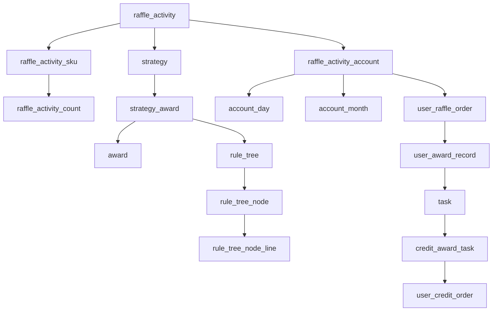
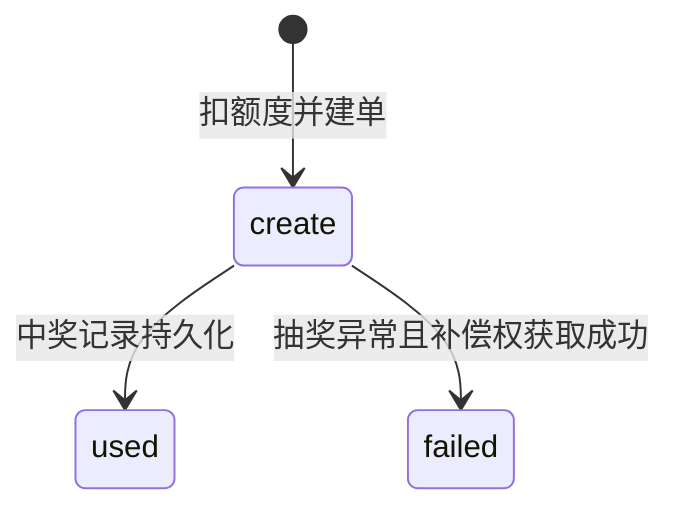
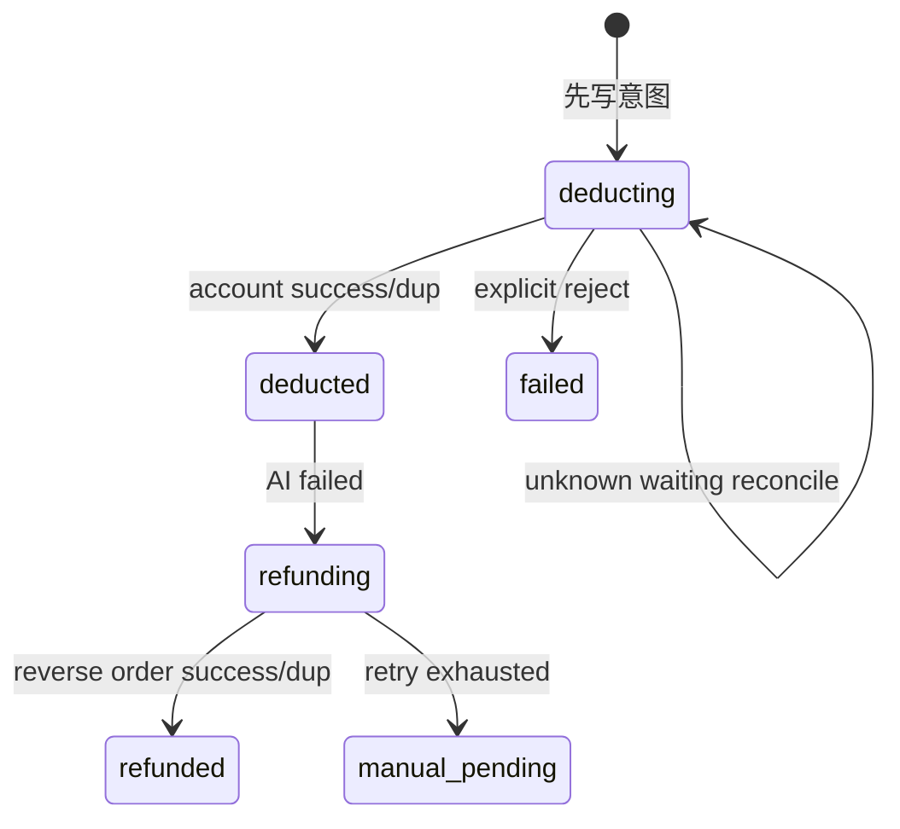

# 数据模型与状态机

## 1. 配置数据与用户事实分开看

### `big_market`：中心配置和平台数据

| 表 | 核心含义 |
|---|---|
| `raffle_activity` | 活动时间、状态、strategyId |
| `raffle_activity_sku` | 活动可购买的 SKU、库存、次数配置 |
| `raffle_activity_count` | 一个 SKU 能充入多少总/月/日额度 |
| `raffle_activity_stage` | 运营展台上架状态，与活动本身 state 是两件事 |
| `strategy` | 策略总配置和责任链模型 |
| `strategy_award` | 奖品概率、库存、规则模型 |
| `strategy_rule` | 黑名单、权重等规则值 |
| `rule_tree` / `rule_tree_node` / `rule_tree_node_line` | 决策树结构 |
| `award` | 奖品类型和奖品配置 |
| `daily_behavior_rebate` | 行为返利配置 |
| `pending_remote_write_task` | 跨分片故障也不应丢失的中央补偿交接 |

### `big_market_01/02`：按用户路由的业务事实

| 表 | 核心含义 |
|---|---|
| `raffle_activity_account` | 用户活动总额度 |
| `raffle_activity_account_month/day` | 用户月/日额度 |
| `raffle_activity_order_000~003` | SKU 购买/充值订单 |
| `user_raffle_order_000~003` | 用户每次抽奖权利和使用状态 |
| `user_award_record_000~003` | 中奖事实 |
| `user_behavior_rebate_order_000~003` | 签到/行为返利订单 |
| `user_credit_account` | 积分余额和账户状态 |
| `user_credit_order_000~003` | 积分交易流水 |
| `task` | 通用 MQ Outbox |
| `credit_award_task` | 积分奖二级 Outbox |
| `chat_credit_session` | Chat 扣费意图、扣款和退款状态 |
| 各类 `*_ledger` | 库存/额度预留、应用、释放的 durable 事实 |

## 2. 主要关系



读表时先找三种键：

- 配置关联键：`activity_id` / `strategy_id` / `award_id` / `tree_id`。
- 用户路由键：`user_id`。
- 业务幂等键：`order_id` / `award_order_id` / `out_business_no` / `message_id` / `request_id`。

## 3. 分库分表如何学

不要只背路由公式，应理解三个目的：

1. 同一 userId 的账户、订单、中奖和流水尽量落在可预测的分片。
2. 业务路径进 DAO 前必须建立 `DBContextHolder`，完成后 `finally` 清理。
3. 跨分片不能假设本地事务；补偿交接不能只写到正在故障的用户分片。

代码入口：

- `big-market-starter-db-router`
- `IDBRouterStrategy.doRouter(userId)`
- `DBContextHolder`
- MyBatis 分表拦截器

> [!warning] 常见错误
> 异步线程复用了 ThreadLocal 路由上下文，但没在 finally 清理，下一个用户可能访问错误分片。

## 4. 核心状态机

### 4.1 抽奖单



`create` 不是异常，它还可以被同一用户后续请求复用；`used` 代表抽奖权利已消费。

### 4.2 Outbox task

```text
create → completed
  └→ fail → completed
           └→ manual_pending
```

`fail` 是可自动重试状态，`manual_pending` 是已超出自动处理边界的人工审核状态。

### 4.3 积分奖任务

```text
pending → dispatched
   └→ failed/manual_pending → 人工原业务号重放
```

### 4.4 Chat 扣费与退款



### 4.5 Durable stock ledger

```text
reserved → applied
   └→ released
```

- `reserved`：已获取预留权，等待投影到 MySQL 库存。
- `applied`：库存已幂等扣减。
- `released`：业务明确拒绝/取消，预留已幂等释放。

## 5. 状态机为什么要用 CAS

以抽奖失败补偿为例，两个并发线程都看到 order=create，若直接都调额度回滚，就可能退两次。

```sql
UPDATE user_raffle_order
SET order_state = 'failed'
WHERE order_id = ? AND order_state = 'create';
```

只有更新行数为 1 的执行者获得补偿权。CAS 不是“为了性能”，而是为了把一次业务状态迁移的权利变成数据库可裁决的原子事实。

## 6. 从数据库还原一次抽奖

用一个 `orderId/awardOrderId` 按顺序查：

1. `user_raffle_order`：谁、哪个活动、订单是否 used。
2. 奖品库存 ledger：这次预留是否 applied。
3. `user_award_record`：抽中什么、发奖状态。
4. `task`：`send_award` 是否确认发布。
5. `credit_award_task`：积分奖是否派发。
6. `user_credit_order`：account 是否出现同一业务号。
7. `user_credit_account`：余额是否变化。

这是排障和面试说“闭环验证”时的核心方法。

## 7. 本篇面试快答

**Q：项目怎么做分库分表？**

> 以 userId 为路由键分到 `big_market_01/02` 和对应的 000~003 表，DB Router 在 DAO 前建立 ThreadLocal 上下文，完成后 finally 清理。配置类表保留在中心库，用户账户/订单/中奖/流水按用户分片。分片只是当前学习设计，没有宣称完成生产容量评估。

**Q：为什么订单要有中间状态？**

> 分布式流程不可能在一个事务内立即完成。中间状态把“执行到哪里”变成持久化事实，宕机后 Job 才能继续；CAS 状态转移又保证只有一个执行者推进或补偿。

## 8. 关联

- DDD 事务边界：[[02-DDD-领域模型与设计模式]]
- 一致性：[[06-一致性-消息库存幂等与补偿]]
- 代码走读：[[09-代码走读清单]]

