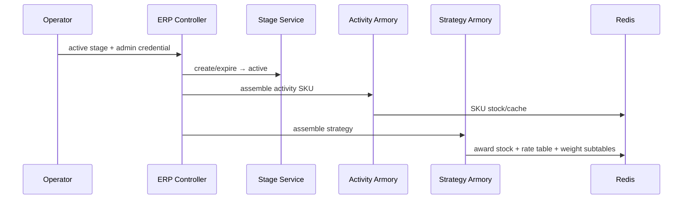
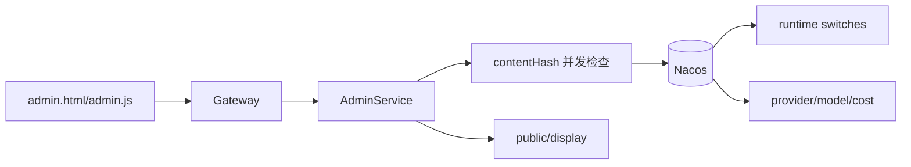

# 运营流程：上架、预热、配置与查询

## 1. 为什么运营流程也是业务闭环

抽奖不是有一个 Controller 就能开始，在用户参与之前需要：

1. 配活动、SKU、策略、奖品和规则。
2. 将活动状态设为可用。
3. 将活动挂到某个 channel/source 展台。
4. 装配活动 SKU 库存和策略概率表。
5. 配用户端展示文案和 Chat 开关。
6. 上线后能跨分片查订单，并观察发奖/库存积压。

## 2. 活动状态与展台状态不是一件事

| 表 | 状态 | 回答的问题 |
|---|---|---|
| `raffle_activity.state` | create/open/close/restart | 这个活动本身是否允许参与 |
| `raffle_activity_stage.state` | create/active/expire | 这个活动是否正在某渠道/来源对用户展示 |

一个活动可以是 open，但没有 active 展台，此时后端业务可用，但用户端不应自动发现它。

## 3. 运营上架与 Armory

核心入口：

- `ErpOperateController.update_stage_activity_2_active`
- `ErpOperateApplicationService`
- `RaffleActivityStageService`
- `RaffleActivityFacade.armory`
- `ActivityArmory`
- `StrategyArmoryDispatch`



安全边界：ERP、activity armory、strategy armory 属于运营写接口，必须经 `OperationalAuthInterceptor`，使用管理员 JWT 或 `X-Admin-Token`。

Armory 的业务含义是把计算和 DB 读取从抽奖热路径前置到活动上线阶段，不是创建新的业务配置。MySQL 配置是源，Redis 是可重建的运行时投影。

## 4. 前端如何找到当前活动

`big-market-web/app.js` 的启动思路：

```text
解析 channel/source
  → GET query_stage_activity_id
  → 得到 active 展台的 activityId
  → GET /admin/config/public/display?activityId=...
  → 载入活动标题、展示文案、Chat 开关
  → 登录后查额度/积分/奖品列表
  → 允许用户签到、兑换、抽奖和 Chat
```

`public/display` 是公开只读接口，因为用户在进入登录页或主页时也需要展示配置；它只能返回审核过的公开字段，不能把 API key、管理 token 等敏感配置透出。

前端存储边界：

- JWT 放 `sessionStorage`，关闭会话后消失。
- 抽奖/Chat 展示历史可使用 `localStorage`，但它不是后端账本。
- 余额、额度、发奖终态必须以后端查询为准。

## 5. Admin 平台配置



要区分：

- Admin 配置修改：Nacos 发布成功才是提交点。
- 活动上架：修改 `raffle_activity_stage` 并执行 Armory。
- 活动自身开闭：修改 `raffle_activity.state`。

三者不应混成一个“发布活动”开关。

## 6. Canal + Elasticsearch 运营查询

### 为什么需要 ES

`user_raffle_order` 和 `raffle_activity_order` 按 userId 分到 2 库 × 4 表。运营按 activityId/时间查所有用户订单时，直接扫 8 张分表不合适。

```text
MySQL row binlog
  → canal-server
  → canal-adapter mapping
  → Elasticsearch 统一索引
  → ErpOperateController 跨用户查询
```

8 张分表使用同一 ES 索引，`_id=order_id`，重复 binlog 投递是覆盖更新，不生成重复文档。

### 一致性边界

- MySQL 是订单写入的权威事实。
- ES 是面向运营查询的异步读模型。
- MySQL 成功后 ES 会有同步延迟，不能用 ES 立即查不到订单来否定写入成功。
- 修改账户/订单状态仍应回到权威写模型，不从 ES 反向修改 MySQL。

这是一个简化 CQRS 视角：写模型按用户分片优化事务，读模型将数据汇总到 ES 优化运营查询。

## 7. 运营排障顺序

用户说“页面看不到活动”：

1. 查 `channel/source` 是否正确。
2. 查 `query_stage_activity_id` 是否返回 active 活动。
3. 查 `raffle_activity.state` 是否 open 且在时间窗口。
4. 查 `public/display` 是否返回对应 activityId 配置。
5. 查 Armory Redis key：SKU 库存、概率范围、概率表、算法标记。
6. 只有上述正常后再看用户 JWT/额度。

运营说“订单查不到”：

1. 先按 userId 路由到 MySQL 确认权威订单。
2. 查 MySQL binlog/Canal server 位点。
3. 查 adapter 映射和失败日志。
4. 查 ES 索引和 `_id=order_id` 文档。
5. 必要时做可审计的全量 ETL，不手工伪造单条 ES 订单。

## 8. 本篇面试快答

**Q：活动为什么要预热？**

> 活动 SKU 库存、奖品库存和概率表都是抽奖热路径依赖的读模型。上架时从 MySQL 配置构建 Redis 投影，将概率计算和多表读取前置，抽奖时只走快速路径；Redis 丢失后也可从权威配置重建。

**Q：为什么运营查询用 ES？**

> 业务写模型按 userId 分成 2 库 × 4 表，运营按活动跨用户查询与写入分片键不一致。通过 Canal 订阅 binlog，将各分表异步汇总到统一 ES 索引，让写模型保持事务局部性，读模型支持跨用户检索。

**Q：ES 查不到刚刚写入的订单是否代表业务失败？**

> 不代表。MySQL 是权威写模型，Canal/ES 是最终一致读模型。应先查 MySQL 订单，再查 binlog、Canal 位点、adapter 和 ES 文档，而不是重复执行业务写入。

## 9. 关联

- 业务主链：[[04-业务流程-核心抽奖闭环]]
- 配置治理：[[08-治理-鉴权配置与可观测性]]
- 数据模型：[[07-数据模型与状态机]]

