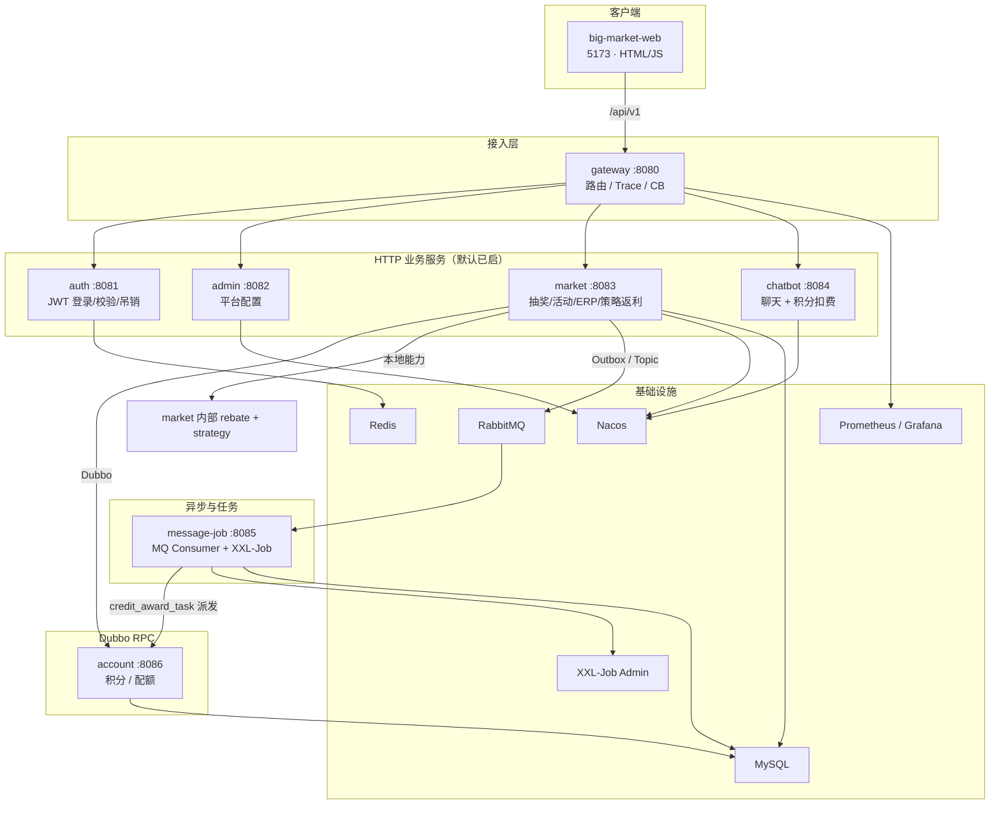
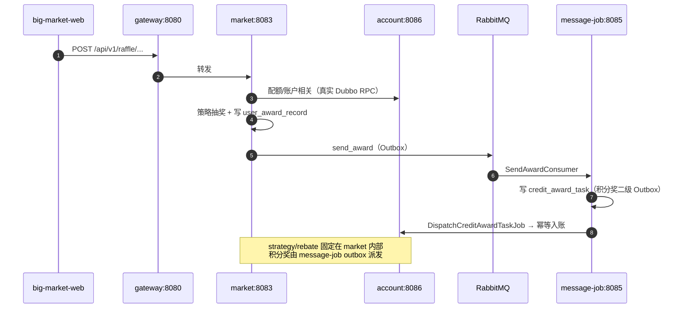
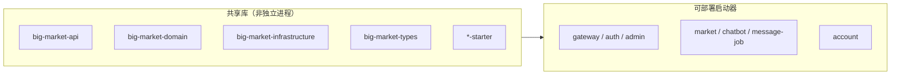
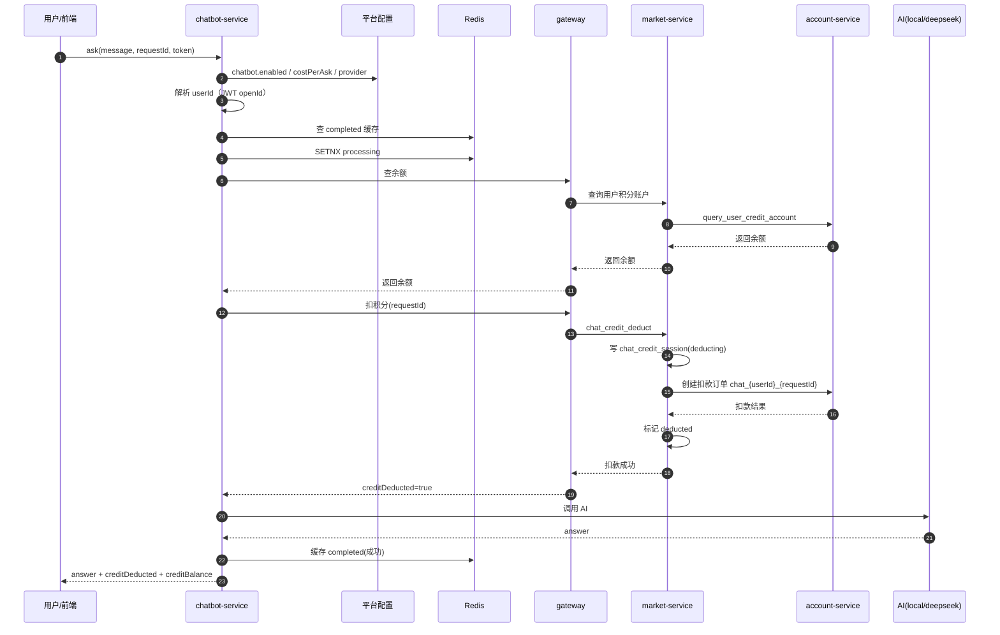

# 总览

> 当前版本：最终 7 个可部署微服务。market 内置策略与返利能力，message-job 负责积分奖二级 Outbox 派发，account 提供积分与额度 RPC（dev/local/test 本地实现，docker/secure 真实 Dubbo 远程实现）。

# DDD

~~~
┌─────────────────────────────────────────────────────────┐
│  Trigger 层（触发器）                                      │
│  HTTP / MQ / XXL-Job                                     │
│  只做：鉴权、参数校验、DTO 转换，不写业务规则               │
├─────────────────────────────────────────────────────────┤
│  Application 层（应用编排）                                │
│  串联一次完整用例：下单 → 抽奖 → 落奖 → 发消息              │
├─────────────────────────────────────────────────────────┤
│  Domain 层（领域核心）                                     │
│  业务规则、聚合、实体、值对象；通过 Port 调外部能力           │
├─────────────────────────────────────────────────────────┤
│  Infrastructure 层（基础设施）                               │
│  实现 Repository/Port：MyBatis、Redis、RabbitMQ、Dubbo   │
└─────────────────────────────────────────────────────────┘
~~~

| 简历用语 | 代码 Bounded Context | 核心业务                                              |
| :------- | :------------------- | :---------------------------------------------------- |
| 策略     | `domain/strategy`    | 概率表装配、O(1) 抽奖、责任链/规则树、奖品库存预扣    |
| 活动     | `domain/activity`    | 活动参与、额度（总/日/月）扣减、抽奖单、活动 SKU 库存 |
| 奖品     | `domain/award`       | 中奖记录、发奖 Outbox、奖品分发（积分/配额等）        |
| 积分     | `domain/credit`      | 积分账户、交易流水、积分相关 Outbox                   |

一次抽奖的调用链：

~~~
POST /api/v1/raffle/activity/draw_by_token
  → RaffleActivityController          [trigger]
  → RaffleDrawApplicationService      [trigger/application]
  → RaffleApplicationService.executeDraw()  [domain/application]
      ① Activity 域：createOrder（扣额度 + 建抽奖单）
      ② Strategy 域：performRaffle（责任链 → 规则树）
      ③ Award 域：saveUserAwardRecord（中奖记录 + Outbox task）
  → SendAwardConsumer                 [message-job/trigger]
  → AwardService.distributeAward()    [domain]
  → credit_award_task Outbox          [message-job]
  → DispatchCreditAwardTaskJob → account RPC [积分入账]
  → SendMessageTaskJob / UpdateAwardStockJob  [补偿 & 库存回写]
~~~

~~~mermaid
sequenceDiagram
    participant U as 用户
    participant T as Trigger/HTTP
    participant A as Activity域
    participant S as Strategy域
    participant W as Award域
    participant MQ as RabbitMQ
    participant C as Credit/Account

    U->>T: draw_by_token
    T->>A: createOrder
  Note over A: 校验活动状态 扣总/日/月额度 生成抽奖单
    A->>S: performRaffle
  Note over S: 责任链选奖 规则树过滤/扣库存
    S-->>A: 奖品ID
    A->>W: saveUserAwardRecord
  Note over W: 写中奖记录+task 同事务落库
    W->>MQ: 事务后发 send_award
    MQ->>W: SendAwardConsumer
    W->>C: distributeAward（积分入账等）

~~~

**阶段 1：活动域 — 有没有资格抽？**

`RaffleActivityPartakeService.createOrder()`（模板方法模式）：

1.  校验活动是否开放
2.  查是否有未使用的抽奖单（幂等复用）
3.  扣额度：总次数 / 日次数 / 月次数（`activity_account`）
4.  活动 SKU 库存责任链校验（`ActivitySkuStockActionChain`）
5.  插入 `user_raffle_order`（状态 `create`）

失败直接抛异常；后续抽奖失败会 补偿回退额度（本地 `compensatePartakeQuota` 或远程 RPC 回滚）

**阶段 2：策略域 — 抽到什么奖？**

第一层：责任链（抽前分流 — 抽哪个奖）

配置顺序来自 `strategy.rule_models`，典型：`rule_blacklist → rule_weight → rule_default`

| 节点     | 业务含义                                                     |
| :------- | :----------------------------------------------------------- |
| 黑名单   | 用户在黑名单 → 直接给兜底奖，链路终止                        |
| 权重分段 | 按用户累计消耗积分匹配段位，在子集概率表里抽（如 `strategyId_4000`） |
| 默认     | 走主概率表，O(1) 随机命中                                    |

第二层：决策树（抽后过滤 — 这个奖能不能发）

从 `rule_tree` 三表加载，典型结构：

~~~
         [次数锁 rule_lock]
        /                  \
   次数达标(ALLOW)      未达标(TAKE_OVER)
      /                      \
 [库存 rule_stock]      [兜底 rule_luck_award]
 /              \
库存够(TAKE_OVER)  不够(ALLOW)
 返回原奖品          → 兜底奖
~~~

-   次数锁：今日抽奖次数未达门槛 → 换成幸运兜底奖
-   库存：Redis 原子 DECR 预扣奖品库存；成功保留原奖，失败走兜底
-   兜底：返回配置的积分/安慰奖

**阶段 3：奖品域 — 记录中奖 & 可靠发奖**

`AwardService.saveUserAwardRecord()` 构建聚合：`user_award_record` + `task`（Outbox）。

Infrastructure 里 `AwardDispatchSupport` 在 同一本地事务 中：

1.  写中奖记录
2.  写 task（`state=create`，消息体已序列化）
3.  标记抽奖单为已使用

事务提交后再发 MQ；成功标 `completed`，失败标 `fail`，由 `SendMessageTaskJob` 扫描补偿。

**阶段 4：异步发奖 & 积分入账**

`SendAwardConsumer` 消费 `send_award` → `AwardService.distributeAward()`：

-   积分随机奖 → 生成随机积分数 → 写 `credit_award_task`（二级 Outbox）
-   `DispatchCreditAwardTaskJob` 扫描 pending 任务 → 调 account-service RPC 入账
-   其他奖品类型按对应 `IDistributeAward` 实现处理；当前演示主路径为积分奖

完整闭环：不能只看 `user_award_record.award_state=completed`，积分奖还要核对 `credit_award_task=dispatched` 和账户流水。

# 简历四点 ↔ 完整业务映射

### 1. 「基于 DDD 划分策略/活动/奖品/积分」

业务含义：营销抽奖不是一个大 Service，而是四个有边界的子域，各自管自己的不变量和数据：

-   活动：用户能不能参与、扣几次、生成什么单
-   策略：按什么规则、什么概率、什么库存条件出奖
-   奖品：中奖事实落库、异步履约
-   积分：账户余额变动、流水、幂等

编排者是活动域的 `RaffleApplicationService`——它自己不写抽奖算法，只编排 Port 调用。这就是 DDD 里 Application Service 的典型职责。

------

### 2. 「Redis O(1) 空间换时间 + 多线程预装配」

业务问题：高并发下每次现场算加权随机，CPU 和 RT 都扛不住。

做法（armory 装配阶段，活动上线前/预热时）：

1.  查策略下所有奖品及概率
2.  把奖品库存写入 Redis（供后续 DECR）
3.  按概率把 `awardId` 展开成查找表（占格越多概率越高）→ shuffle → 存 Redis Hash
4.  若有权重分段，为每个段位再建一张子表（`strategyId_4000`）

抽奖时：`secureRandom.nextInt(rateRange)` → Redis `HGET` → O(1) 得到 `awardId`。

概率范围过大时切 `OLogNAlgorithm`，在内存和速度间折中。线程池主要用于 库存异步回写、Outbox 补偿 等热点外路径，把耗时操作移出抽奖主链路。

------

### 3. 「责任链 + 决策树双层规则引擎」

业务问题：抽奖规则复杂且常变——黑名单、积分段位、次数门槛、库存、兜底——不能全写死在 `if-else` 里。

| 层     | 模式                         | 解决什么               | 配置来源               |
| :----- | :--------------------------- | :--------------------- | :--------------------- |
| 责任链 | 线性，接管即停               | 抽哪个奖（抽前）       | `strategy.rule_models` |
| 决策树 | 有向图，ALLOW/TAKE_OVER 分支 | 能不能发这个奖（抽后） | `rule_tree` 三表       |

新增规则 = 加节点 + 改配置，不改 `performRaffle` 主流程。链节点用 `@Scope(PROTOTYPE)`，每次构建新实例，避免 `next` 指针污染。

活动域自己也有责任链（SKU 库存校验），和策略域的规则引擎是同一设计思想的不同应用场景。

------

### 4. 「Outbox + Redis 预扣库存 + 异步回写 DB」

这是 两条互补的高可用机制：

A. 消息最终一致（Outbox）

| 问题                                   | 做法                                                         |
| :------------------------------------- | :----------------------------------------------------------- |
| 先发 MQ 后写库，DB 失败 → 发了奖没记录 | 不行                                                         |
| 先写库后发 MQ，进程宕机 → 有记录没发奖 | 不行                                                         |
| 正确做法                               | 业务数据 + task 同事务落库 → 事务外发 MQ → Job 补偿 `fail`/`create` 超时任务 |

同类模式还用于：返利 `send_rebate`、积分交易、积分奖品二级 Outbox。

B. 库存高并发（Redis 预扣 + 异步投影）

| 层级   | 存储                                                         | 时机                                     |
| :----- | :----------------------------------------------------------- | :--------------------------------------- |
| 热路径 | Redis `strategy_award_count:{strategyId}_{awardId}` 原子 DECR | 抽奖实时                                 |
| 冷路径 | MySQL `stock_count_surplus` 批量 UPDATE                      | `UpdateAwardStockJob` 从延迟队列拉取回写 |

并发正确性以 Redis 为准；MySQL 是异步投影，最终一致。活动 SKU 库存同理。

# 微服务

## big-market-gateway

端口：8080

路由转发、Trace 透传、CORS、熔断降级、可选限流。鉴权在下游服务里做，account / message-job 等 不经网关（Dubbo/MQ）

~~~mermaid
sequenceDiagram
  participant C as Client
  participant Trace as TraceIdGlobalFilter
  participant Cors as CorsWebFilter
  participant Route as Route + Filters
  participant CB as CircuitBreaker
  participant S as Downstream
  participant FB as FallbackController

  C->>Trace: HTTP /api/v1/...
  Trace->>Trace: 注入/透传 X-Trace-Id
  Trace->>Cors: 继续
  Cors->>Route: 匹配 Path
  Route->>CB: 转发前经熔断器
  alt 下游正常
    CB->>S: 代理请求
    S-->>C: 业务响应 + X-Trace-Id
  else 超时/失败/熔断打开
    CB->>FB: forward:/fallback/{service}
    FB-->>C: 503 + code=0007
  end

~~~

路由规则: application-dev.yml。没有服务发现：URI 是静态 `http://host:port`，不靠 Nacos 动态路由 。
顺序：auth → admin → chatbot → market 兜底 `/api/**`

TraceId：跨服务串日志的钥匙

-   请求已有 `X-Trace-Id` → 沿用；否则生成无横线 UUID
-   写入转发下游的请求头
-   在响应头里回显给客户端

CORS：跨域许可。协议/域名/端口任一不同就算跨域

熔断与降级：每条路由都挂了 Resilience4j `CircuitBreaker`，失败时 `forward` 到网关自己的 Controller FallbackController

| 参数                                  | 值   | 含义             |
| :------------------------------------ | :--- | :--------------- |
| slidingWindowSize                     | 10   | 最近 10 次统计   |
| failureRateThreshold                  | 50   | 失败率 ≥50% 打开 |
| waitDurationInOpenState               | 10s  | 打开后冷却       |
| permittedNumberOfCallsInHalfOpenState | 3    | 半开试探         |
| timelimiter timeoutDuration           | 30s  | 单次调用超时     |

限流：自定义 IpPathRateLimit ; key：`IP + 路径前两段`（如 `/api/v1`）

## big-market-auth-service

端口 8081

无状态 JWT 认证入口，负责登录签发、校验、登出吊销。服务本身很薄，真正逻辑在共享的 `big-market-domain` 的 `domain.auth` 里

### `POST login` — 登录

流程：

1.  校验 `userId` / `password` 非空
2.  用配置里的 `app.auth.dev-users`（如 `xiaofuge:demo,admin:admin`）做明文比对（没有用户表，凭证完全来自配置，是学习/Demo 账号源）校验账户密码是否正确
3.  签发 Token（往 JWT 里放：openId/sub = userId，jti = 随机 UUID，iat/exp = 现在 + 24h; 用 app.jwt.secret 派生的密钥做 HS256 签名;  compact() 得到一串 header.payload.signature，直接返回给前端

### `GET verify` — 校验 Token

读 `Authorization` 头 → `authService.checkToken`：

-   验签 + 未过期；
-   若有吊销服务，再查 jti 是否在黑名单（logout 时会把 `jti` 写入 Redis/内存黑名单，取出 `jti`，问黑名单 `isRevoked`。logout 过的 → `false`）

成功返回 `data = openid`（即登录时的 userId）；失败返回 `TOKEN_ERROR`。

### `POST logout` — 吊销

取 jti 和过期时间，决定黑名单留多久（兜底：按默认 TTL 留 24 小时， 解析不出 `exp` 时才用） 看 `token-revocation.redis.enabled`（本项目 dev/docker 默认 `true`

| 实现                             | 行为                                                         |
| :------------------------------- | :----------------------------------------------------------- |
| `RedisTokenRevocationService`    | Docker/secure 默认使用；key=`jwt:revoked:{jti}`，TTL = 剩余秒数；写失败抛异常 → logout 不能假成功 |
| `InMemoryTokenRevocationService` | 仅供 dev/local/test 单进程使用；map 里 `jti → expiresAt`，不能用于多实例生产 |

之后任意服务的 `checkToken` 都会因 jti 黑名单拒绝该 Token。

## big-market-admin-service

端口 8082

| 平台配置 CRUD  | 活动展示文案、Chatbot 开关/模型、全局降级/限流开关等         |
| -------------- | ------------------------------------------------------------ |
| Nacos 配置发布 | 保存后推送到 Nacos，供 `chatbot-service` 等订阅消费          |
| Nacos 运行时配置 | `system.degradeSwitch` / `system.rateLimiterSwitch` 发布到专用 runtime DataId，market listener 整体替换快照 |

Nacos 是唯一权威源；服务内仅保留不可变运行时快照，本地文件不参与运行时读写。

### 管理员鉴权

1.  必须有 `Authorization` 头
2.  支持 `Bearer <jwt>` 或裸 JWT
3.  `authService.checkToken()` — 验签 + 过期 + Redis 吊销黑名单（Docker 栈开启）
4.  `openid` 必须在 `app.admin.user-ids` 白名单（默认 `admin`，逗号分隔）
5.  通过后把 `userId` 写入 request attribute

### 配置存储核心：`PlatformConfigService`

-   内存：`AtomicReference<Map<String, AdminConfigResponseDTO>>`，仅是 Nacos DataId 快照
-   权威源：`big-market-platform-config` + `big-market-runtime-switches`
-   格式：`{namespace}.{configKey}.value` / `.description`

启动时拉取 Nacos payload 后构建不可变快照；空值、删除或非法 payload 会安全重置为编译期安全默认值。

保存流程

~~~
1. 生成 candidate 快照
2. 序列化目标 DataId 的完整内容
3. publishToNacos(content)         ← 发布失败直接返回错误，不报告本地成功
4. 原子替换不可变内存快照
5. 返回 DTO（带 contentHash、nacosPublished=true、source=nacos）
~~~

### Nacos 配置同步

发布端（admin-service）

订阅端（market/chatbot）启动时拉取 + 注册 listener，收到变更后分别调用 `refreshRuntimeFromContent()` / `refreshPlatformFromContent()`；每次变更都整体替换快照。

~~~
管理员 save → PlatformConfigService → Nacos publish
                                         ↓
                              chatbot-service listener
                                         ↓
                              market/chatbot listener 整体刷新快照
                                         ↓
                              ChatbotApplicationService 读取 enabled/provider 等快照
~~~

### 运行时配置与安全边界

运行时开关只经 Nacos 发布和 listener 生效，不存在第二配置中心或运行时实现切换：

~~~ java
admin 保存 system.degradeSwitch / system.rateLimiterSwitch
  → PlatformConfigService.save
  → Nacos big-market-runtime-switches
  → market listener
  → RuntimeConfigHolder 整体快照原子替换
  → 当前请求使用新快照（无需重启）
~~~

`chatbot.enabled/provider/apiKey/baseUrl/model` 位于 `big-market-platform-config`，由 chatbot listener 整体刷新；删除、空值和非法值均回到安全默认值。

## big-market-market-service

端口 8083 

对外：抽奖、签到、积分、SKU 兑换、运营 API；策略、返利为 market 内部能力；运行时开关从 Nacos listener 生效。

对内：编排活动参与 → 策略决策 → 中奖落库

当前：strategy、rebate、activity、erp 的内部能力由 market 进程统一承载，
随 market 一起启动和发布；`trigger.job` / `trigger.listener` 只在 message-job-service 加载。

`market-service` 本身是「壳」。业务代码主要在 `big-market-trigger`（HTTP/RPC）、`big-market-domain`（领域）、`big-market-infrastructure`（DAO/Redis/MQ）。`market-service` 负责启动扫描、配置和 Adapter 路由。

### 鉴权分层

`WebMvcConfig` 注册了两类拦截器

-   用户侧：`TokenAuthInterceptor` — JWT 校验（`Authorization` 头）
-   运营侧：`OperationalAuthInterceptor` — 管理 Token（`X-Admin-Token` 等）

### 抽奖活动 — `RaffleActivityController`

/api/v1/raffle/activity/

| 接口                                   | 作用                  |
| :------------------------------------- | :-------------------- |
| `draw_by_token`                        | 核心抽奖（JWT 鉴权）  |
| `calendar_sign_rebate_by_token`        | 签到返利              |
| `query_user_activity_account_by_token` | 查活动配额/参与次数   |
| `query_user_credit_account_by_token`   | 查积分余额            |
| `credit_pay_exchange_sku_by_token`     | 积分兑换 SKU          |
| `chat_credit_deduct/refund_by_token`   | Chatbot 积分扣费/退款 |
| `armory`                               | 活动数据预热（运营）  |
| `query_stage_activity_id`              | 查当前上架活动        |

### 抽奖策略 — `RaffleStrategyController`

/api/v1/raffle/strategy/

-   策略装配（`strategy_armory`）
-   查奖品列表、执行策略抽奖等

### ERP 运营 — `ErpOperateController`

路径前缀：`/api/v1/raffle/erp/`

-   查用户抽奖单（含 ES）
-   活动阶段上架、生效等运营操作

### Nacos 运行时配置

-   Admin 将 `system.degradeSwitch` / `system.rateLimiterSwitch` 发布到 `big-market-runtime-switches`。
-   market listener 原子刷新 `RuntimeConfigHolder` 整体快照。
-   `open` 以业务码 `0004` 拦截抽奖，`close` 恢复抽奖路径。
-   不存在本地/远程账户运行时开关；`docker/secure` 使用 `RemoteActivityAccountPort`，`dev/local/test` 使用 `LocalActivityAccountPort`。

### 核心抽奖流程

1.  扣配额、建参与单
2.  策略引擎出奖
3.  写中奖记录（后续由 `message-job-service` 消费 MQ 做履约发奖）
4.  失败则补偿回退配额

### 内部 RPC Provider

market 进程同时承载 activity、strategy、erp 等内部 Dubbo Provider，
默认应用栈只启动最终 7 个服务。

## big-market-chatbot-service

端口 8084

接收用户提问、按配置扣积分、调用 AI（或本地规则回复）、失败时触发退款，并通过 Redis + MySQL 保证幂等与补偿。

它不直接管积分账本——扣款/退款走 gateway → market-service → account-service；退款补偿由 message-job-service 的 XXL-Job 扫描处理

### 主流程：用户正常提问

**Step 1：参数与开关** message 为空 → 直接报错
enabled=false → 走关闭分支（见下文），不扣费、不调 AI

`PlatformConfigService` / Nacos subscriber 启动时拉取完整的 `big-market-platform-config` DataId，并在 listener 变更时整体替换进程内不可变快照。

Nacos 是唯一权威源；空值、删除或非法 payload 会安全重置默认值，Nacos 发布失败则 fail-closed，不报告本地保存成功。

**Step 2：计费与登录校验**

-   收费模式（`costPerAsk > 0`）：必须登录，从 JWT 解析 `userId`
-   免费模式（`costPerAsk = 0`）：可不登录，`userId` 记为 `__anonymous__`
-   `requestId` 客户端不传时，服务端自己生成 UUID

**Step 3：幂等门禁（Redis）**

| 情况                       | 业务含义                    | 结果                                |
| :------------------------- | :-------------------------- | :---------------------------------- |
| Redis 已有 `completed`     | 同一用户同一 requestId 重放 | 直接返回上次答案，不再扣费、不调 AI |
| `SETNX` 成功               | 首次处理                    | 继续往下                            |
| `SETNX` 失败且无 completed | 并发重复提交                | 提示「处理中，请稍后重试」          |

幂等键是 `userId + requestId`，不同用户即使用相同 requestId 也互不影响。

**Step 4：扣积分（先收钱，再调 AI）**

chatbot 经 gateway 调 market 两个公开接口：

-   查余额：`/raffle/activity/query_user_credit_account_by_token`
-   扣费：`/raffle/activity/chat_credit_deduct_by_token?amount=1&requestId=xxx`

market 侧扣费业务（`ChatCreditApplicationService.deduct`）顺序是：

1.  先落库意图：`chat_credit_session`，状态 `deducting`
2.  再扣账本：account 创建订单，业务号 `chat_{userId}_{requestId}`（保证幂等）
3.  确认扣费成功：会话标记 `deducted`

>   设计意图：先记「这笔对话要扣钱」再动账本，这样即使后面 AI 挂了，也有据可查、可退。

扣费若失败：

-   积分不足 → 明确拒绝，清除 Redis `processing`，用户可换 requestId 重试
-   扣费过程异常 → 同样清除 `processing`，不缓存失败结果

在锁保护下，用一次数据库事务完成「改余额 + 记流水 + 登记异步通知（chat场景下没意义，积分兑换发货有用）」；减积分时余额不够就整笔失败；同一业务单号重复提交只认第一次，从而保证积分账准确、可追溯、可补偿（整体的积分变动动作）

**Step 5：调用 AI**

`provider` 由当前 Nacos 快照明确选择 `local` 或 `deepseek`，不因远程失败静默切换实现；AI 超时/异常进入退款流程，由 `chat_credit_session` + message-job 补偿任务按同一业务号幂等退款。

**Step 6：成功返回**

组装响应：

-   `answer`：AI 文本
-   `creditDeducted`：本次扣了多少（如 1）
-   `creditBalance`：扣后余额
-   `toolName`：`local` 或 `deepseek`

同时 Redis 写入 `completed` 缓存（7 天），供重放使用。

## big-market-message-job-service

端口 8085

负责 RabbitMQ 消费、XXL-Job 任务、Outbox 派发、失败重试和补偿：

- `SendAwardConsumer` 消费发奖消息并创建 `credit_award_task`
- `DispatchCreditAwardTaskJob` 负责积分奖到账户服务的幂等派发
- `SendMessageTaskJob`、库存回写、Chat 退款和远程写对账任务均由本服务承载
- `RemoteWriteReconcileJob` 扫描 `pending_remote_write_task`，按最大重试次数推进失败状态；人工复核后可用 `scripts/replay-pending-remote-write.sh` 重放
- `DlqReplayJob` 默认关闭，死信重放必须经过人工审核
- market 不扫描 `trigger.job` / `trigger.listener`，消息消费和任务调度只归本服务

## big-market-account-service

端口 8086

负责积分账户、积分交易、活动额度和额度账本，并通过 Dubbo 提供账户 RPC：

- 积分余额、积分流水和积分交易幂等
- 总额度、日额度、月额度扣减与回滚
- 为 market、chatbot、message-job 提供账户和额度 RPC
- UNKNOWN 结果通过业务号查询和对账任务确认，不进行盲目重复扣款
- `dev/local/test` Profile 使用 `LocalActivityAccountPort`
- `docker/secure` Profile 使用 `RemoteActivityAccountPort`，通过真实 Dubbo Netty RPC（`injvm=false`）调用
- 不存在运行时本地/远程切换，也不允许远程失败后静默回退本地实现
- 活动额度扣减账本在 `big_market_01/02` 均有四张分片表，路由上下文在 finally 清理

# 当前验证与冻结边界

- 已验证 7 个应用服务健康（8080–8086）；MySQL、Redis、RabbitMQ、Nacos、Elasticsearch 健康，XXL-Job executor 已注册。
- `./scripts/acceptance.sh --reuse --skip-playwright` 最终通过：Maven verify、迁移/DDL、HTTP 合约、`smoke-test-microservices` 20/20、Nacos 动态配置、抽奖发奖 E2E、Chat refund E2E 均通过；Playwright 按参数跳过。
- 动态配置已验证：`system.degradeSwitch` open/close 可拦截/恢复抽奖，`chatbot.enabled` false/true 可被 listener 收到并恢复正常值。
- secure Profile 的 JWT、Nacos、XXL-Job、RabbitMQ、MySQL 等凭证由环境变量注入，不使用非 dev 默认密钥；Chatbot API key 只从 Nacos 平台快照读取。
- 积分奖闭环要求 `user_award_record`、`credit_award_task=dispatched` 与 account 积分流水同时成立；禁止绕过 Outbox 直写账户积分。
- 当前状态为 conditional learning freeze：fresh volume、真实 secure overlay 启动和 MySQL/Redis/RabbitMQ/Nacos 短暂不可用后的恢复尚未做运行时注入验证。完整 `docker compose up --build` 的 web/nginx 拉取曾受 Docker Hub 授权限制；7 个 Java 镜像及现有 web 镜像栈已验证。
- 当前数据库保留 4 条历史 `quota_create` 失败远程写记录，未自动重放；应先用 `scripts/replay-pending-remote-write.sh --dry-run` 审核后再处理。
- 审计期间未删除真实用户 Volume，未创建 Git commit。
