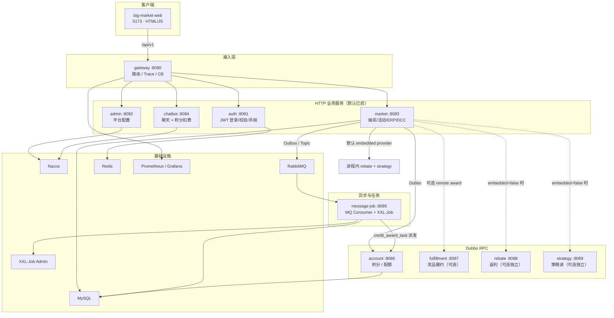
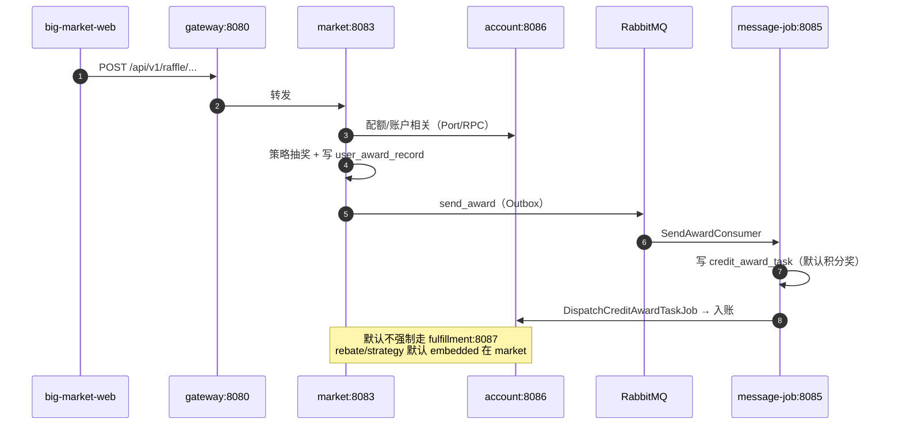
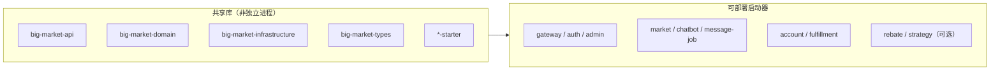
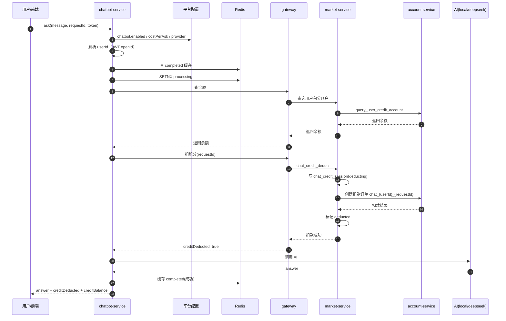

# 总览

## DDD

~~~
┌─────────────────────────────────────────────────────────┐
│  Trigger 层（触发器）                                      │
│  HTTP / MQ / XXL-Job                                     │
│  只做：鉴权、参数校验、DTO 转换，不写业务规则               │
├─────────────────────────────────────────────────────────┤
│  Application 层（应用编排）                                │
│  串联一次完整用例：下单 → 抽奖 → 落奖 → 发消息              │
├─────────────────────────────────────────────────────────┤
│  Domain 层（领域核心）                                     │
│  业务规则、聚合、实体、值对象；通过 Port 调外部能力           │
├─────────────────────────────────────────────────────────┤
│  Infrastructure 层（基础设施）                               │
│  实现 Repository/Port：MyBatis、Redis、RabbitMQ、Dubbo   │
└─────────────────────────────────────────────────────────┘
~~~

| 简历用语 | 代码 Bounded Context | 核心业务                                              |
| :------- | :------------------- | :---------------------------------------------------- |
| 策略     | `domain/strategy`    | 概率表装配、O(1) 抽奖、责任链/规则树、奖品库存预扣    |
| 活动     | `domain/activity`    | 活动参与、额度（总/日/月）扣减、抽奖单、活动 SKU 库存 |
| 奖品     | `domain/award`       | 中奖记录、发奖 Outbox、奖品分发（积分/配额等）        |
| 积分     | `domain/credit`      | 积分账户、交易流水、积分相关 Outbox                   |

一次抽奖的调用链：

~~~
POST /api/v1/raffle/activity/draw_by_token
  → RaffleActivityController          [trigger]
  → RaffleDrawApplicationService      [trigger/application]
  → RaffleApplicationService.executeDraw()  [domain/application]
      ① Activity 域：createOrder（扣额度 + 建抽奖单）
      ② Strategy 域：performRaffle（责任链 → 规则树）
      ③ Award 域：saveUserAwardRecord（中奖记录 + Outbox task）
  → SendAwardConsumer                 [trigger/MQ]
  → AwardService.distributeAward()    [domain]
  → Credit 域 / Account RPC           [积分入账]
  → SendMessageTaskJob / UpdateAwardStockJob  [补偿 & 库存回写]
~~~

# 微服务

## big-market-gateway

端口：8080

路由转发、Trace 透传、CORS、熔断降级、可选限流。鉴权在下游服务里做，account / message-job 等 不经网关（Dubbo/MQ）

~~~mermaid
sequenceDiagram
  participant C as Client
  participant Trace as TraceIdGlobalFilter
  participant Cors as CorsWebFilter
  participant Route as Route + Filters
  participant CB as CircuitBreaker
  participant S as Downstream
  participant FB as FallbackController

  C->>Trace: HTTP /api/v1/...
  Trace->>Trace: 注入/透传 X-Trace-Id
  Trace->>Cors: 继续
  Cors->>Route: 匹配 Path
  Route->>CB: 转发前经熔断器
  alt 下游正常
    CB->>S: 代理请求
    S-->>C: 业务响应 + X-Trace-Id
  else 超时/失败/熔断打开
    CB->>FB: forward:/fallback/{service}
    FB-->>C: 503 + code=0007
  end

~~~

路由规则: application-dev.yml。没有服务发现：URI 是静态 `http://host:port`，不靠 Nacos 动态路由 。
顺序：auth → admin → chatbot → market 兜底 `/api/**`

TraceId：跨服务串日志的钥匙

-   请求已有 `X-Trace-Id` → 沿用；否则生成无横线 UUID
-   写入转发下游的请求头
-   在响应头里回显给客户端

CORS：跨域许可。协议/域名/端口任一不同就算跨域

熔断与降级：每条路由都挂了 Resilience4j `CircuitBreaker`，失败时 `forward` 到网关自己的 Controller FallbackController

| 参数                                  | 值   | 含义             |
| :------------------------------------ | :--- | :--------------- |
| slidingWindowSize                     | 10   | 最近 10 次统计   |
| failureRateThreshold                  | 50   | 失败率 ≥50% 打开 |
| waitDurationInOpenState               | 10s  | 打开后冷却       |
| permittedNumberOfCallsInHalfOpenState | 3    | 半开试探         |
| timelimiter timeoutDuration           | 30s  | 单次调用超时     |

限流：自定义 IpPathRateLimit ; key：`IP + 路径前两段`（如 `/api/v1`）

## big-market-auth-service

端口 8081

无状态 JWT 认证入口，负责登录签发、校验、登出吊销。服务本身很薄，真正逻辑在共享的 `big-market-domain` 的 `domain.auth` 里

### `POST login` — 登录

流程：

1.  校验 `userId` / `password` 非空
2.  用配置里的 `app.auth.dev-users`（如 `xiaofuge:demo,admin:admin`）做明文比对（没有用户表，凭证完全来自配置，是学习/Demo 账号源）校验账户密码是否正确
3.  签发 Token（往 JWT 里放：openId/sub = userId，jti = 随机 UUID，iat/exp = 现在 + 24h; 用 app.jwt.secret 派生的密钥做 HS256 签名;  compact() 得到一串 header.payload.signature，直接返回给前端

### `GET verify` — 校验 Token

读 `Authorization` 头 → `authService.checkToken`：

-   验签 + 未过期；
-   若有吊销服务，再查 jti 是否在黑名单（logout 时会把 `jti` 写入 Redis/内存黑名单，取出 `jti`，问黑名单 `isRevoked`。logout 过的 → `false`）

成功返回 `data = openid`（即登录时的 userId）；失败返回 `TOKEN_ERROR`。

### `POST logout` — 吊销

取 jti 和过期时间，决定黑名单留多久（兜底：按默认 TTL 留 24 小时， 解析不出 `exp` 时才用） 看 `token-revocation.redis.enabled`（本项目 dev/docker 默认 `true`

| 实现                             | 行为                                                         |
| :------------------------------- | :----------------------------------------------------------- |
| `RedisTokenRevocationService`    | key=`jwt:revoked:{jti}`，TTL = 剩余秒数；写失败抛异常 → logout 不能假成功 |
| `InMemoryTokenRevocationService` | map 里 `jti → expiresAt`；仅本进程有效，跨服务不同步         |

之后任意服务的 `checkToken` 都会因 jti 黑名单拒绝该 Token。

## big-market-admin-service

端口 8082

| 平台配置 CRUD  | 活动展示文案、Chatbot 开关/模型、全局降级/限流开关等         |
| -------------- | ------------------------------------------------------------ |
| Nacos 配置发布 | 保存后推送到 Nacos，供 `chatbot-service` 等订阅消费          |
| DCC 运行时同步 | 部分 `system.*` 开关变更时，经网关回调 `market-service` 写入 ZooKeeper DCC |

配置存在内存 + 本地 properties 文件里，属于轻量“平台配置中心”的学习实现

### 管理员鉴权

1.  必须有 `Authorization` 头
2.  支持 `Bearer <jwt>` 或裸 JWT
3.  `authService.checkToken()` — 验签 + 过期 + Redis 吊销黑名单（Docker 栈开启）
4.  `openid` 必须在 `app.admin.user-ids` 白名单（默认 `admin`，逗号分隔）
5.  通过后把 `userId` 写入 request attribute

### 配置存储核心：`PlatformConfigService`

-   内存：`ConcurrentHashMap<String, AdminConfigResponseDTO>`
-   磁盘：`data/platform-config.properties`（可用 `-Dbig.market.config.store=...` 覆盖）
-   格式：`{namespace}.{configKey}.value` / `.description`

默认值 → 本地文件 → Nacos 覆盖（Nacos 启用时以远端为准）

保存流程

~~~
1. 记下 previous（用于失败回滚）
2. 写入内存 configStore
3. saveToDisk()                    ← 全量刷 properties
4. serializePropertiesContent()    ← 同样内容转成字符串
5. publishToNacos(content)         ← 全量推 Nacos（未启用则跳过）
6. syncDynamicConfigIfNeeded()     ← 仅 system.degradeSwitch / rateLimiterSwitch 再推 DCC
7. 返回 DTO（带 contentHash、nacosPublished、source）
~~~

### Nacos 配置同步

发布端（admin-service）

订阅端（chatbot-service）`NacosConfigSubscriberConfig` 启动时拉取 + 注册 listener，收到变更后 `platformConfigService.refreshFromContent()`

~~~
管理员 save → PlatformConfigService → Nacos publish
                                         ↓
                              chatbot-service listener
                                         ↓
                              PlatformConfigService 内存刷新
                                         ↓
                              ChatbotApplicationService 读 enabled/provider 等
~~~

### DCC 动态配置同步

平台配置里的 `system.degradeSwitch` / `system.rateLimiterSwitch` 不仅要存 Nacos，还要推到 ZooKeeper DCC，让运行中的抽奖/限流逻辑即时生效。（历史遗留，可统一）

~~~ java
admin 保存 system.degradeSwitch
  → PlatformConfigService.save
  → Nacos publish
  → DccDynamicConfigSyncAdapter → gateway → market DCCController → ZK
  → @DCCValue 字段热更新（无需重启）
~~~

## big-market-market-service

端口 8083 

对外：抽奖、签到、积分、SKU 兑换、运营、DCC 等 HTTP API

对内：编排活动参与 → 策略决策 → 中奖落库

默认：把 strategy / rebate / activity / erp 的 Dubbo Provider 内嵌在同一进程，降低本地部署复杂度

切换到独立微服务：把 `embedded-rpc-provider.enabled` 设为 `false`，并打开对应的 `remote-*.enabled`，再启动独立服务容器即可；调用方代码不用改。

`market-service` 本身是「壳」。业务代码主要在 `big-market-trigger`（HTTP/RPC）、`big-market-domain`（领域）、`big-market-infrastructure`（DAO/Redis/MQ）。`market-service` 负责启动扫描、配置和 Adapter 路由。

### 鉴权分层

`WebMvcConfig` 注册了两类拦截器

-   用户侧：`TokenAuthInterceptor` — JWT 校验（`Authorization` 头）
-   运营侧：`OperationalAuthInterceptor` — 管理 Token（`X-Admin-Token` 等）

### 抽奖活动 — `RaffleActivityController`

/api/v1/raffle/activity/

| 接口                                   | 作用                  |
| :------------------------------------- | :-------------------- |
| `draw_by_token`                        | 核心抽奖（JWT 鉴权）  |
| `calendar_sign_rebate_by_token`        | 签到返利              |
| `query_user_activity_account_by_token` | 查活动配额/参与次数   |
| `query_user_credit_account_by_token`   | 查积分余额            |
| `credit_pay_exchange_sku_by_token`     | 积分兑换 SKU          |
| `chat_credit_deduct/refund_by_token`   | Chatbot 积分扣费/退款 |
| `armory`                               | 活动数据预热（运营）  |
| `query_stage_activity_id`              | 查当前上架活动        |

### 抽奖策略 — `RaffleStrategyController`

/api/v1/raffle/strategy/

-   策略装配（`strategy_armory`）
-   查奖品列表、执行策略抽奖等

### ERP 运营 — `ErpOperateController`

路径前缀：`/api/v1/raffle/erp/`

-   查用户抽奖单（含 ES）
-   活动阶段上架、生效等运营操作

### 动态配置 DCC — `DCCController`

路径前缀：`/api/v1/raffle/dcc/`

-   通过 ZooKeeper 动态改配置（如降级开关 `degradeSwitch`）

### 核心抽奖流程

1.  扣配额、建参与单
2.  策略引擎出奖
3.  写中奖记录（后续由 `message-job-service` 消费 MQ 做履约发奖）
4.  失败则补偿回退配额

### Embedded RPC Provider

默认配置下，这个进程同时充当多个 Dubbo 服务的 Provider，无需单独起 `strategy-service`、`rebate-service` 等容器

## big-market-chatbot-service

端口 8084

接收用户提问、按配置扣积分、调用 AI（或本地规则回复）、失败时触发退款，并通过 Redis + MySQL 保证幂等与补偿。

它不直接管积分账本——扣款/退款走 gateway → market-service → account-service；退款补偿由 message-job-service 的 XXL-Job 扫描处理

### 主流程：用户正常提问

**Step 1：参数与开关** message 为空 → 直接报错
enabled=false → 走关闭分支（见下文），不扣费、不调 AI

`PlatformConfigService` 启动时按顺序填充 `configStore`

优先级（后写覆盖前写）：

1.  代码默认值：`chatbot.enabled = "true"`
2.  本地磁盘：`data/platform-config.properties`
3.  Nacos 远端（有则覆盖）：`big-market-platform-config`（监听 Nacos 变更，运营改配置会热更新内存）

**Step 2：计费与登录校验**

-   收费模式（`costPerAsk > 0`）：必须登录，从 JWT 解析 `userId`
-   免费模式（`costPerAsk = 0`）：可不登录，`userId` 记为 `__anonymous__`
-   `requestId` 客户端不传时，服务端自己生成 UUID

**Step 3：幂等门禁（Redis）**

| 情况                       | 业务含义                    | 结果                                |
| :------------------------- | :-------------------------- | :---------------------------------- |
| Redis 已有 `completed`     | 同一用户同一 requestId 重放 | 直接返回上次答案，不再扣费、不调 AI |
| `SETNX` 成功               | 首次处理                    | 继续往下                            |
| `SETNX` 失败且无 completed | 并发重复提交                | 提示「处理中，请稍后重试」          |

幂等键是 `userId + requestId`，不同用户即使用相同 requestId 也互不影响。

**Step 4：扣积分（先收钱，再调 AI）**

chatbot 经 gateway 调 market 两个公开接口：

-   查余额：`/raffle/activity/query_user_credit_account_by_token`
-   扣费：`/raffle/activity/chat_credit_deduct_by_token?amount=1&requestId=xxx`

market 侧扣费业务（`ChatCreditApplicationService.deduct`）顺序是：

1.  先落库意图：`chat_credit_session`，状态 `deducting`
2.  再扣账本：account 创建订单，业务号 `chat_{userId}_{requestId}`（保证幂等）
3.  确认扣费成功：会话标记 `deducted`

>   设计意图：先记「这笔对话要扣钱」再动账本，这样即使后面 AI 挂了，也有据可查、可退。

扣费若失败：

-   积分不足 → 明确拒绝，清除 Redis `processing`，用户可换 requestId 重试
-   扣费过程异常 → 同样清除 `processing`，不缓存失败结果

在锁保护下，用一次数据库事务完成「改余额 + 记流水 + 登记异步通知（chat场景下没意义，积分兑换发货有用）」；减积分时余额不够就整笔失败；同一业务单号重复提交只认第一次，从而保证积分账准确、可追溯、可补偿（整体的积分变动动作）

**Step 5：调用 AI**

**Step 6：成功返回**

组装响应：

-   `answer`：AI 文本
-   `creditDeducted`：本次扣了多少（如 1）
-   `creditBalance`：扣后余额
-   `toolName`：`local` 或 `deepseek`

同时 Redis 写入 `completed` 缓存（7 天），供重放使用。

## big-market-message-job-service

## big-market-account-service

## big-market-fulfillment-service

## big-market-rebate-service

## big-market-strategy-service

